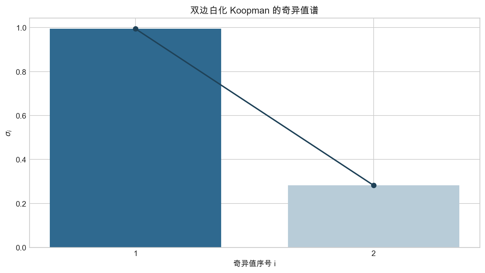
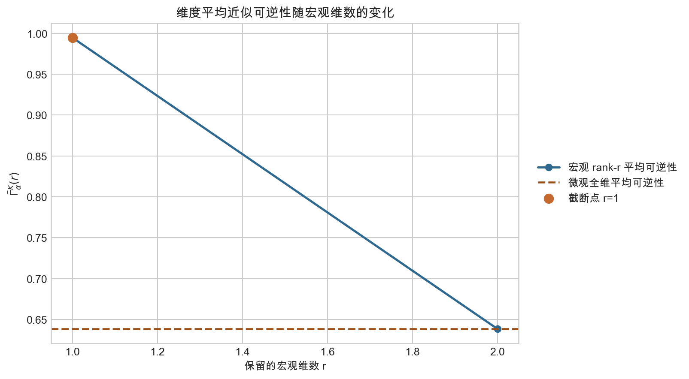
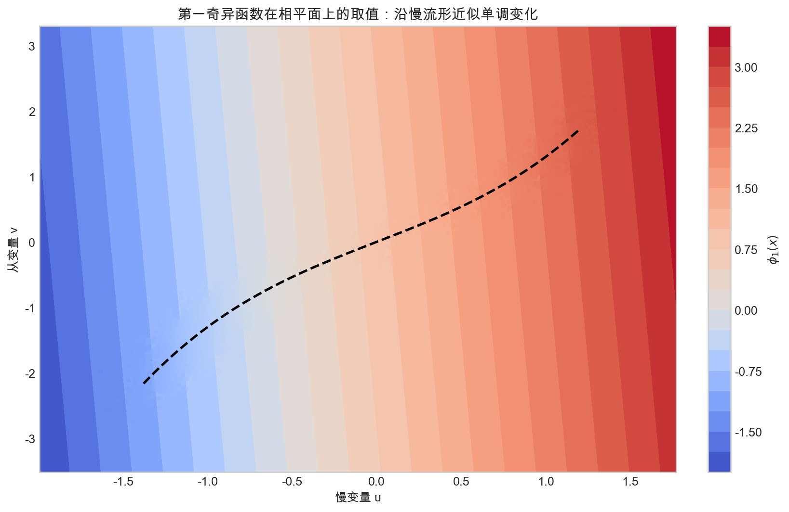
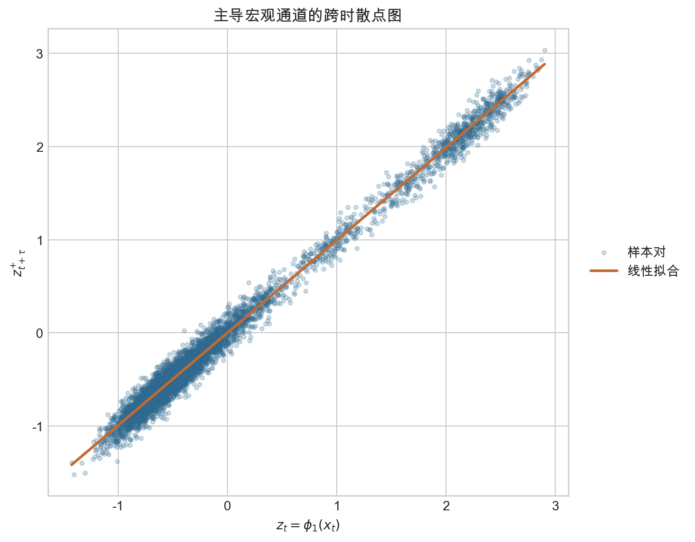

# 双边白化 Koopman 与因果涌现：面向非线性随机动力学的研究方法框架

## 目录

### 主文

- [1. 研究目标与核心转向](#sec-1)
- [2. 一般随机动力学与 Koopman 算子](#sec-2)
  - [2.1 随机动力学与 Koopman 算子](#sec-2-1)
  - [2.2 有限维统计对象](#sec-2-2)
- [3. 双边白化 Koopman 矩阵](#sec-3)
  - [3.1 对象选择](#sec-3-1)
  - [3.2 数学性质](#sec-3-2)
- [4. 宏观变量构造](#sec-4)
  - [4.1 主导通道与宏观变量](#sec-4-1)
- [5. 确定性项与非简并项](#sec-5)
  - [5.1 与 `GIS` 的理论对照](#sec-5-1)
- [6. 白化 Koopman 与因果涌现](#sec-6)
  - [6.1 近似可逆性的标准定义](#sec-6-1)
  - [6.2 粗粒化函数的选择](#sec-6-2)
  - [6.3 粗粒化原则](#sec-6-3)
  - [6.4 粗粒化流程](#sec-6-4)
  - [6.5 慢流形与序参量](#sec-6-5)
- [7. 实验结果与验证](#sec-7)
  - [7.1 二维随机慢流形案例](#sec-7-1)
  - [7.2 二维线性高斯验证例子](#sec-7-2)
- [8. 理论任务与科学假设](#sec-8)
  - [8.1 理论任务](#sec-8-1)
  - [8.2 科学假设](#sec-8-2)
- [9. 结论](#sec-9)
- [参考文献线索](#sec-ref)

### 附录

- [附录 A. 双边白化矩阵与原始回归/`EDMD` 视角的关系](#app-a)
- [附录 B. 定理 1 的证明：白化谱对组内可逆线性变换不变](#app-b)
- [附录 C. 定理 2 与定理 3 的证明：白化奇异值就是时间滞后典型相关系数](#app-c)
- [附录 D. `VAMP` 变分原理的有限维化：为何退化为对白化矩阵做 SVD](#app-d)
- [附录 E. 命题 3 的证明：宏观变量对角化跨时耦合](#app-e)
- [附录 F. 命题 4 与定理 4、定理 5 的推导说明](#app-f)
- [附录 G. 第 5.1 节协方差关系的证明](#app-g)
- [附录 H. 定理 6 的证明：残差项给出确定性对象](#app-h)
- [附录 I. 定理 7 的证明：当前侧版本给出非简并性对象](#app-i)
- [附录 J. 推论 1 的证明：`GIS` 指标可由 $D_K,\widetilde D_K$ 与增强项精确重写](#app-j)
- [附录 K. 命题 5 的陈述与证明：分解后的单通道得分与原始奇异值排序等价](#app-k)
- [附录 L. 定理 8 的证明：白化宏观坐标是投影 Koopman 算子的左奇异函数](#app-l)
- [附录 M. 当前侧非简并性算子、增强项与换序的算子解释](#app-m)
- [附录 O. 标准定义与分解补充的关系](#app-o)
- [附录 P. 命题 6 的证明：当前侧最优粗粒化对应 $\bar K$ 的左奇异子空间](#app-p)
- [附录 Q. 既有因果涌现文献回顾](#app-q)
- [附录 R. 为何不直接用原始 EDMD 特征向量做宏观化](#app-r)

<a id="sec-1"></a>
## 1. 研究目标与核心转向

本文档给出一个面向后续论文 `Method` 的研究框架：将研究对象从经典 EDMD 中回归意义下的 Koopman 近似矩阵
<a id="eq-1-1"></a>
$$
K_{\mathrm{raw}} = C_{00}^{\dagger} C_{01}
\tag{1.1}
$$
转向双边白化后的时间滞后 Koopman 矩阵
<a id="eq-1-2"></a>
$$
\bar K = C_{00}^{-1/2} C_{01} C_{11}^{-1/2}.
\tag{1.2}
$$

这一转向并不只是数值预处理，而是研究对象的根本改变。`EDMD` 的对象是一个依赖坐标尺度和组内线性参数化的最小二乘回归算子，这一点可追溯到 Williams et al. (2015) 对数据驱动 Koopman 近似的经典表述，也与 Brunton et al. (2022) 对现代 Koopman 理论的综述口径一致；双边白化后的对象则等价于时间滞后典型相关分析 `TCCA` / `feature TCCA` / `VAMP` 中的核心矩阵，其奇异值天然位于区间 `[0,1]` 内，可被解释为跨时间预测通道的 canonical correlations。正因为如此，双边白化 Koopman 矩阵比原始 EDMD 矩阵更适合作为“动力学可逆性”与“因果涌现”之间的桥梁对象。

更深一层的理论主线来自 Govindarajan et al. (2019) 对测度保持变换 Koopman 谱逼近的研究。该文表明：在适当细化的等测度划分下，可以构造 periodic approximations，使相应的有限维 Koopman 近似成为置换算子，并在弱意义上逼近原始 Koopman 算子的谱信息。于是，对理想的测度保持、可逆动力学而言，“完全可逆”的核心并不是抽象地最大化某个分数，而是逼近一个 unitary / permutation 的理想参照结构，即奇异值整体贴近 `1` 的有限维极限。离散 `TPM` 上 Zhang 2025 使用的 `\Gamma` 指标，正是这一理想参照结构在有限状态空间中的特例化表达；本文则进一步把这条主线推广到一般非线性随机动力学上。之所以选取双边白化 Koopman 矩阵，而不是原始回归矩阵，就是因为前者在有限样本、有限字典下仍保留了这种“以 `1` 为自然上界”的奇异值几何，同时又能作为无限维 Koopman/Perron-Frobenius 谱在随机情形下的可计算有限秩代理。

本文提出的总体思想是：

1. 用观测函数或 lifted features 将非线性随机动力学嵌入到可分析的 Hilbert 空间中；
2. 用双边白化的时间滞后协方差矩阵刻画真正与跨时预测结构相关的不变量；
3. 用其主导奇异值和奇异向量定义宏观变量、宏观维数以及 CE-aware 的动力学可逆性指标；
4. 以 Govindarajan 2019 的 periodic-approximation / permutation 理想参照结构为主线，把该指标与 Zhang 2025 的离散 `SVD-based` 理论、经典 `EI-based CE`、以及 Gaussian iterative systems 上的可逆性理论联系起来。

下文将严格成立的结论、条件成立下的近似结论，以及仍需进一步证明的研究假设分开表述。

<a id="sec-2"></a>
## 2. 一般随机动力学与 Koopman 算子

<a id="sec-2-1"></a>
### 2.1 随机动力学与 Koopman 算子

设离散时间非线性随机动力学在所选时间滞后 $\tau \ge 1$ 下写为
<a id="eq-2-1"></a>
$$
\mathbf{x}_{t+\tau}=F_\tau(\mathbf{x}_t,\boldsymbol{\eta}_t^{(\tau)}),\qquad \boldsymbol{\eta}_t^{(\tau)} \sim \nu_\tau,
\tag{2.1}
$$
其中 $F_\tau$ 表示从 $t$ 到 $t+\tau$ 的 $\tau$ 步随机演化映射，$\boldsymbol{\eta}_t^{(\tau)}$ 汇总该时间窗内注入的随机性。并记其诱导的状态过程为 $\{\mathbf{x}_t\}_{t \in \mathbb Z}$。我们假设该过程在所选滞后 $\tau$ 下满足 Markov 或近似 Markov 条件。本文允许底层动力学是非线性的、含噪的，甚至只在局部满足可线性化条件。

对任意可积观测函数 $g:\mathcal X\to\mathbb R$，定义时间滞后 $\tau$ 的随机 Koopman 算子为
<a id="eq-2-2"></a>
$$
(\mathcal K_\tau g)(\mathbf{x}):=\mathbb E\!\left[g(\mathbf{x}_{t+\tau})\,\middle|\,\mathbf{x}_t=\mathbf{x}\right].
\tag{2.2}
$$

在无噪声确定性情形，若
<a id="eq-2-3"></a>
$$
\mathbf{x}_{t+\tau}=\Phi_\tau(\mathbf{x}_t),
\tag{2.3}
$$
则上式退化为熟悉的组合形式
<a id="eq-2-4"></a>
$$
(\mathcal K_\tau g)(\mathbf{x})=g(\Phi_\tau(\mathbf{x})).
\tag{2.4}
$$

因此，本文后续讨论的各种有限维矩阵对象，都应被理解为这一 Koopman 算子在观测函数空间、有限样本和有限秩近似下的可计算代理，而不是脱离动力学本身另行定义的纯代数矩阵。

<a id="sec-2-2"></a>
### 2.2 有限维统计对象

为把上述 Koopman 观点落到可计算的有限维对象上，引入两组观测函数
<a id="eq-2-5"></a>
$$
g_0 : \mathcal X \to \mathbb{R}^{m_0}, \qquad
g_1 : \mathcal X \to \mathbb{R}^{m_1},
\tag{2.5}
$$
并定义时间滞后观测对
<a id="eq-2-6"></a>
$$
\mathbf{X}_t = g_0(\mathbf{x}_t), \qquad \mathbf{Y}_t = g_1(\mathbf{x}_{t+\tau}).
\tag{2.6}
$$

在后续推导中，更自然的对象是去均值后的观测
<a id="eq-2-7"></a>
$$
\tilde{\mathbf{X}}_t = \mathbf{X}_t - \mathbb{E}[\mathbf{X}_t], \qquad
\tilde{\mathbf{Y}}_t = \mathbf{Y}_t - \mathbb{E}[\mathbf{Y}_t].
\tag{2.7}
$$
若采用二阶矩而非协方差写法，只需将[式（2.7）](#eq-2-7)中的去均值版本替换为原始观测，相关公式保持不变。

#### 定义 1：时间滞后协方差矩阵

定义两侧自协方差与跨时协方差为
<a id="eq-2-8"></a>
$$
C_{00} = \mathbb{E}[\tilde{\mathbf{X}}_t \tilde{\mathbf{X}}_t^\top], \qquad
C_{11} = \mathbb{E}[\tilde{\mathbf{Y}}_t \tilde{\mathbf{Y}}_t^\top], \qquad
C_{01} = \mathbb{E}[\tilde{\mathbf{X}}_t \tilde{\mathbf{Y}}_t^\top].
\tag{2.8}
$$

它们分别描述：

- 当前观测空间内部的几何结构；
- 未来观测空间内部的几何结构；
- 当前与未来之间真正的跨时耦合结构。

在经验实现中，这三个对象由时间滞后配对样本的经验平均得到；若协方差奇异，则在其正特征值支撑子空间上采用 Moore-Penrose 伪逆平方根。

<a id="sec-3"></a>
## 3. 双边白化 Koopman 矩阵

<a id="sec-3-1"></a>
### 3.1 对象选择

有了随机 Koopman 算子之后，下一步问题就不再是“是否做 SVD”，而是“究竟该对哪个有限维对象做 SVD”。本文的主线结论是：若目标是把 Koopman 分析与动力学可逆性、进一步与因果涌现连接起来，那么合适的对象不应是任意回归矩阵，而应是双边白化后的时滞 Koopman 矩阵。

这一选择首先来自一个算子层面的理想参照结构。Govindarajan 2019 研究测度保持变换的 Koopman 谱逼近，说明在适当细化的等测度划分下，可以构造 periodic approximations，使相应的有限维 Koopman 近似成为置换算子，并在弱意义下逼近原始 Koopman 谱。于是，对 deterministic measure-preserving dynamics 而言，有限维近似想要保留的关键结构，不是某个任意回归矩阵的数值大小，而是“是否逼近 permutation / unitary operator”这一可逆性理想参照。

一旦把这一理想参照说清楚，奇异值语言中的目标也就随之明确了。置换矩阵的全部奇异值都等于 `1`，因此在有限维层面，“奇异值整体接近全 `1`”正是“接近可逆、接近置换”的直接表达。Zhang 2025 在离散 `TPM` 上引入的 `\Gamma_\alpha(P)`，也应在这个意义下理解：它不是脱离背景的抽象分数，而是上述理想参照在有限状态空间中的一个可计算代理；在 `TPM` 约束下，`\Gamma_\alpha` 取到极大值与“逼近置换矩阵”恰好一致。

本文研究的系统则比上述离散、无噪理想情形更一般：动力学可以是非线性的、随机的，数据只能以有限样本方式访问，而且通常只能恢复有限秩的跨时统计结构，而不能直接得到 Govindarajan 2019 所讨论的完整谱投影逼近；对于具有连续谱的情形，这类“只能在有限秩或离散谱子空间中工作”的限制在 Ghosh (2025) 中也被明确强调。因此，下一个必须回答的问题是：在随机、有限样本的设定下，什么样的有限维对象仍然尽可能保留这一理想参照的几何内核？

#### 定义 3：双边白化 Koopman 矩阵

定义双边白化后的时间滞后 Koopman 矩阵为
<a id="eq-3-1"></a>
$$
\bar K = C_{00}^{-1/2} C_{01} C_{11}^{-1/2}.
\tag{3.1}
$$

选择[式（3.1）](#eq-3-1)而不是直接使用原始回归矩阵，原因就在于这里的双边白化把当前侧与未来侧各自的组内几何、尺度膨胀以及字典冗余先剥离掉，再把奇异值谱集中到真正的跨时耦合上。换言之，若本文要在随机动力学中寻找一个最接近“有限维 Koopman 应该逼近 unitary / permutation 理想参照结构”这一主线的可计算对象，那么最自然的候选就是 $\bar K$，因为它把问题重新表述成了对 past-future predictive channels 的分析。

若 $C_{00}, C_{11}$ 奇异，则[式（3.1）](#eq-3-1)应理解为其支撑子空间上的 reduced whitening，或等价地理解为伪逆平方根构成的表达式。若需要它与原始回归/`EDMD` 视角之间的显式关系，可见附录 A。

仅仅给出定义 3 还不够。若要让 $\bar K$ 真正承担后文关于奇异值、宏观变量和近似可逆性的主线角色，我们还必须先证明：它的谱不会随着观测尺度、冗余字典和组内坐标选择任意漂移。否则，它就仍然只是一个方便计算的矩阵，而不是能够稳定承载 past-future coupling 的理论对象。下面就在本节的数学性质部分正式回答这个问题。

<a id="sec-3-2"></a>
### 3.2 数学性质

<a id="sec-3-2-1"></a>
#### 3.2.1 白化谱与对象选择

#### 定理 1：双边白化谱对白化前的组内可逆线性变换不变

这条定理回答的正是上一节留下的问题：为什么本文后续的奇异值分析要建立在 $\bar K$ 上，而不是建立在原始回归矩阵 $K_{\mathrm{raw}}$ 上。核心原因是，双边白化之后保留下来的谱信息只反映真实的跨时耦合结构，而不会被两侧观测空间内部的坐标选择任意操纵。

对当前与未来两侧分别施加可逆线性变换
<a id="eq-3-2"></a>
$$
\mathbf{X}_t' = S_0 \mathbf{X}_t, \qquad \mathbf{Y}_t' = S_1 \mathbf{Y}_t,
\tag{3.2}
$$
其中 $S_0, S_1$ 可逆，则由 `CCA/TCCA` 理论可知，白化矩阵 $\bar K'$ 与 $\bar K$ 的奇异值完全相同；换言之，canonical correlations 对组内可逆线性变换不变。相比之下，原始矩阵
<a id="eq-3-3"></a>
$$
K_{\mathrm{raw}} = C_{00}^{\dagger} C_{01}
\tag{3.3}
$$
的谱会显式依赖观测尺度、冗余字典和组内坐标选择。

因此，定理 1 在全文中的作用有两层。第一，它把“白化会去掉组内几何干扰”这一直觉提升为一个明确的对象筛选准则：我们需要一个对组内可逆重参数化稳定、却对真实 past-future coupling 敏感的谱对象。第二，它为后文把奇异值解释为 canonical predictive channels 铺路；只有先说明这些奇异值不被组内坐标任意操纵，后续把它们用于定义宏观变量、讨论近似可逆性和连接 Zhang 2025 的 `\Gamma_\alpha` 才有解释上的稳固基础。

<a id="sec-3-2-2"></a>
#### 3.2.2 奇异值的统计含义

#### 定义 4：时间滞后典型变量

给定系数向量 $\mathbf{a} \in \mathbb{R}^{m_0}$ 与 $\mathbf{b} \in \mathbb{R}^{m_1}$，定义标量典型变量
<a id="eq-3-4"></a>
$$
u_t = \mathbf{a}^\top \tilde{\mathbf{X}}_t, \qquad
v_t = \mathbf{b}^\top \tilde{\mathbf{Y}}_t.
\tag{3.4}
$$
在约束
<a id="eq-3-5"></a>
$$
\mathrm{Var}(u_t)=1, \qquad \mathrm{Var}(v_t)=1
\tag{3.5}
$$
下，最大化 $\mathrm{Corr}(u_t,v_t)$ 所得到的最优解，给出第一对典型变量；继续施加正交约束，可得到整组典型变量及其对应的 canonical correlations。这一表述直接承接 Hotelling (1936) 的经典典型相关分析框架。

#### 定理 2：双边白化 Koopman 的奇异值等于时间滞后典型相关系数

设
<a id="eq-3-6"></a>
$$
\bar K = U \Sigma V^\top, \qquad
\Sigma = \mathrm{diag}(\sigma_1,\ldots,\sigma_q),
\tag{3.6}
$$
其中 $q=\min(m_0,m_1)$，则：

1. $\sigma_i$ 恰为 $(\tilde{\mathbf{X}}_t,\tilde{\mathbf{Y}}_t)$ 的第 $i$ 个时间滞后典型相关系数；
2. 左奇异向量 $\mathbf{u}_i$ 与右奇异向量 $\mathbf{v}_i$ 分别给出当前侧和未来侧的最优典型方向；
3. 该结果与 `feature TCCA` 完全一致，也是 `VAMP` 在固定观测函数下的有限维实现；相关变分表述可与 Wu and Noe (2020) 对 Markov 过程学习的统一视角对应起来。

该定理说明，$\bar K$ 的奇异值谱不是一般意义下的“数值谱”，而是跨时预测通道强度的排序。

<a id="sec-3-2-3"></a>
#### 3.2.3 奇异值上界

#### 定理 3：双边白化 Koopman 的奇异值满足上界 $\sigma_i(\bar K) \le 1$

对任意标准定义的白化矩阵
<a id="eq-3-7"></a>
$$
\bar K = C_{00}^{-1/2} C_{01} C_{11}^{-1/2},
\tag{3.7}
$$
有
<a id="eq-3-8"></a>
$$
\sigma_i(\bar K) \le 1, \qquad \forall i.
\tag{3.8}
$$

特别地，
<a id="eq-3-9"></a>
$$
\sigma_{\max}(\bar K) \le 1.
\tag{3.9}
$$

其本质原因在于：白化后的奇异值就是 canonical correlations，而典型相关系数不可能超过 `1`。该结论在奇异协方差情形下仍成立，只需把白化限制到正特征值支撑子空间上。也正因为存在这一上界，[式（3.8）](#eq-3-8)-[式（3.9）](#eq-3-9) 才把 Govindarajan 2019 中“酉/置换算子的奇异值全部等于 `1`”这一理想参照平滑地延续到了随机、有限维、可计算的情形：在本文设定里，我们不再直接要求得到一个真正的置换矩阵，而是要求奇异值谱尽可能贴近这个由 `1` 给出的上界。

因此，后文采用的 `\Gamma_\alpha^K` 也不应被理解为凭空最大化的分数，而应被理解为“奇异值整体接近全 `1`”这一目标的可计算汇总；这正是它能与 Zhang 2025 在 `TPM` 上的 `\Gamma_\alpha(P)` 保持理念对齐的原因。`VAMP` 变分原理在本文中只承担一个补充解释角色：它说明双边白化矩阵 $\bar K$ 的主导奇异方向不仅是典型相关方向，而且也可被理解为有限维特征空间中的最优预测通道。完整的变分问题及其退化到对白化矩阵做奇异值分解的推导，统一放到附录 D，不在正文展开。

对时间序列而言，当前与未来的典型相关分析还可进一步与 Hankel 算子的奇异值谱联系起来。Jewell, Bloomfield, and Bartmann (1983) 早已从 time-series 的 past-future canonical correlation 角度讨论过这一类结构。换言之，白化后的跨时相关谱不仅是一个可计算矩阵谱，也可被理解为“过去对未来的可预测通道”的奇异值排序。这一层解释与上节的 Govindarajan-Zhang 主线并不冲突，而是说明双边白化 Koopman 既有算子层面理想参照的含义，也有 time-series predictive channels 的含义。

<a id="sec-4"></a>
## 4. 宏观变量构造

<a id="sec-4-1"></a>
### 4.1 主导通道与宏观变量

#### 定义 5：白化当前变量与白化未来变量

定义两侧白化变量
<a id="eq-4-1"></a>
$$
\boldsymbol{\xi}_t = C_{00}^{-1/2} \tilde{\mathbf{X}}_t, \qquad
\boldsymbol{\eta}_t = C_{11}^{-1/2} \tilde{\mathbf{Y}}_t.
\tag{4.1}
$$
则
<a id="eq-4-2"></a>
$$
\mathbb{E}[\boldsymbol{\xi}_t \boldsymbol{\xi}_t^\top] = I, \qquad
\mathbb{E}[\boldsymbol{\eta}_t \boldsymbol{\eta}_t^\top] = I,
\tag{4.2}
$$
且
<a id="eq-4-3"></a>
$$
\mathbb{E}[\boldsymbol{\xi}_t \boldsymbol{\eta}_t^\top] = \bar K.
\tag{4.3}
$$

#### 定义 6：秩 $r$ 的宏观变量

对
<a id="eq-4-4"></a>
$$
\bar K = U \Sigma V^\top
\tag{4.4}
$$
取前 $r$ 个奇异三元组，记
<a id="eq-4-5"></a>
$$
U_r = [\mathbf{u}_1,\ldots,\mathbf{u}_r], \qquad
V_r = [\mathbf{v}_1,\ldots,\mathbf{v}_r].
\tag{4.5}
$$
定义当前宏观变量与未来宏观变量为
<a id="eq-4-6"></a>
$$
\mathbf{z}_t = U_r^\top \boldsymbol{\xi}_t
= U_r^\top C_{00}^{-1/2} \tilde{\mathbf{X}}_t,
\tag{4.6}
$$
<a id="eq-4-7"></a>
$$
\mathbf{z}_{t+\tau}^{+} = V_r^\top \boldsymbol{\eta}_t
= V_r^\top C_{11}^{-1/2} \tilde{\mathbf{Y}}_t.
\tag{4.7}
$$

这两个对象分别代表当前侧与未来侧最重要的 $r$ 个 canonical predictive channels。

#### 命题 3：宏观变量对角化跨时耦合

上述定义满足
<a id="eq-4-8"></a>
$$
\mathbb{E}[\mathbf{z}_t \mathbf{z}_t^\top] = I_r, \qquad
\mathbb{E}[\mathbf{z}_{t+\tau}^{+} (\mathbf{z}_{t+\tau}^{+})^\top] = I_r,
\tag{4.8}
$$
且
<a id="eq-4-9"></a>
$$
\mathbb{E}[\mathbf{z}_t (\mathbf{z}_{t+\tau}^{+})^\top]
= U_r^\top \bar K V_r
= \mathrm{diag}(\sigma_1,\ldots,\sigma_r).
\tag{4.9}
$$

因此，所保留的宏观变量具有三重性质：

1. 组内已白化，不受原始尺度影响；
2. 跨时相关已对角化，不同宏观通道彼此解耦；
3. 各通道按可预测强度从大到小排序。

这正是 CE 语境中“去除冗余信息通道、保留高效因果通道”的自然数学版本。

<a id="sec-5"></a>
## 5. 确定性项与非简并项

在明确了双边白化 Koopman 矩阵的主线地位、谱性质以及由其诱导的宏观变量之后，本文再回到 `GIS` 语境下讨论确定性与非简并性。这里的目的不是重新用分解定义取代正文主线，而是在闭式高斯基准上说明：双边白化矩阵还能被进一步拆解成 `determinism / nondegeneracy` 两个可解释分量；这一讨论与 Liu et al. (2025) 在线性高斯 `SVD-based CE` 语境下的结果尤其相关。关于 `EI-based CE`、离散 `SVD-based CE`、以及 Gaussian iterative systems 上的既有文献回顾，统一见附录 Q。

<a id="sec-5-1"></a>
### 5.1 与 `GIS` 的理论对照

上面的 `GIS` 框架仍然使用显式的线性矩阵 $A$ 与噪声协方差 $\Sigma$。为了把它与本文的双边白化 Koopman 对象真正接起来，我们考虑一阶、中心化、线性高斯迭代系统
<a id="eq-5-1"></a>
$$
\mathbf{x}_{t+1} = A \mathbf{x}_t + \boldsymbol{\eta}_t, \qquad \boldsymbol{\eta}_t \sim \mathcal N(0,\Sigma), \qquad \boldsymbol{\eta}_t \perp \mathbf{x}_t,
\tag{5.1}
$$
并在本小节中固定使用 `identity observable` 与一步滞后。记
<a id="eq-5-2"></a>
$$
C_{00} = \mathbb{E}[\mathbf{x}_t \mathbf{x}_t^\top], \qquad
C_{01} = \mathbb{E}[\mathbf{x}_t \mathbf{x}_{t+1}^\top], \qquad
C_{11} = \mathbb{E}[\mathbf{x}_{t+1} \mathbf{x}_{t+1}^\top].
\tag{5.2}
$$
则有
<a id="eq-5-3"></a>
$$
C_{01} = C_{00} A^\top, \qquad
C_{11} = A C_{00} A^\top + \Sigma.
\tag{5.3}
$$
其证明见文末附录 G。

在该情形下，双边白化 Koopman 矩阵
<a id="eq-5-4"></a>
$$
\bar K = C_{00}^{-1/2} C_{01} C_{11}^{-1/2}
= C_{00}^{1/2} A^\top C_{11}^{-1/2}
\tag{5.4}
$$
不仅是一个“规范化预测通道矩阵”，还可被精确分解成 `GIS` 风格的两个条件结构对象。这里需要提前强调本文后续的取舍：这类分解主要用于理论解释和与 `GIS` 文献做补充性对照，而不再作为本文“近似可逆性”的标准定义。

#### 定理 6：双边白化矩阵的残差项给出确定性对象

在线性高斯条件下，
<a id="eq-5-5"></a>
$$
\bar K^\top \bar K
= C_{11}^{-1/2} A C_{00} A^\top C_{11}^{-1/2},
\tag{5.5}
$$
因此
<a id="eq-5-6"></a>
$$
I - \bar K^\top \bar K
= C_{11}^{-1/2} \Sigma C_{11}^{-1/2}.
\tag{5.6}
$$

若 $\Sigma \succ 0$，则可定义
<a id="eq-5-7"></a>
$$
D_K := (I-\bar K^\top \bar K)^{-1},
\tag{5.7}
$$
并得到
<a id="eq-5-8"></a>
$$
D_K = C_{11}^{1/2} \Sigma^{-1} C_{11}^{1/2}.
\tag{5.8}
$$

这说明 `GIS` 框架中的确定性项 $\Sigma^{-1}$，可以由双边白化矩阵的残差结构精确恢复。

#### 定义 10：Koopman 确定性算子（理论补充）

对一般双边白化矩阵 $\bar K$，定义其确定性算子为
<a id="eq-5-9"></a>
$$
D_K := (I-\bar K^\top \bar K)^{-1},
\tag{5.9}
$$
若 $I-\bar K^\top \bar K$ 奇异，则在其正特征值支撑子空间上取伪逆。

在闭式 `GIS` 情形下，$D_K$ 与 $\Sigma^{-1}$ 只差未来侧白化坐标变换。

#### 定理 7：双边白化矩阵的当前侧版本给出非简并性对象

在同样的线性高斯条件下，定义
<a id="eq-5-10"></a>
$$
\widetilde D_K := (I-\bar K \bar K^\top)^{-1}.
\tag{5.10}
$$
则有
<a id="eq-5-11"></a>
$$
\widetilde D_K
= I + C_{00}^{1/2} A^\top \Sigma^{-1} A C_{00}^{1/2}.
\tag{5.11}
$$

这说明：若把当前侧版本 $\widetilde D_K$ 直接视为非简并性对象，那么它与 `GIS` 框架中的 $A^\top \Sigma^{-1} A$ 只差一个单位基线；真正对应 `GIS` 闭式项的是其增强部分 $\widetilde D_K-I$。

#### 定义 11：Koopman 非简并性算子（理论补充）

对一般双边白化矩阵 $\bar K$，定义其非简并性算子为
<a id="eq-5-12"></a>
$$
\widetilde D_K := (I-\bar K \bar K^\top)^{-1}.
\tag{5.12}
$$

在闭式 `GIS` 情形下，$\widetilde D_K$ 与 $I + C_{00}^{1/2} A^\top \Sigma^{-1} A C_{00}^{1/2}$ 一致；若要恢复原始 `GIS` 的非简并性增强项，则取 $\widetilde D_K-I$。

#### 推论 1：`GIS` 的完整可逆性指标可由双边白化矩阵精确重写

记
<a id="eq-5-13"></a>
$$
C_{\mathrm{marg},\alpha}
= \frac{n}{2}\log(2\pi\alpha) -\left(\frac12-\frac{\alpha}{4}\right)\log\det C_{00} -\frac{\alpha}{4}\log\det C_{11}.
\tag{5.13}
$$
则在线性高斯、`identity observable`、一步滞后的条件下，
<a id="eq-5-14"></a>
$$
\log \Gamma_\alpha^{\mathrm{GIS}}
= C_{\mathrm{marg},\alpha} + \left(\frac12-\frac{\alpha}{4}\right)\log \operatorname{pdet}(\widetilde D_K-I) + \frac{\alpha}{4}\log \operatorname{pdet}(D_K).
\tag{5.14}
$$

因此，在线性高斯、`identity observable`、一步滞后的闭式条件下，`GIS` 的完整可逆性指标可以被精确表达为“双边白化 Koopman 矩阵所诱导出的边缘几何修正项、确定性项与非简并性项的组合”。这说明：

- 将 `Koopman-CE` 分解成 `determinism + nondegeneracy` 两部分，不是脱离原始双边白化分析另起炉灶；
- 恰恰相反，它只是把 $\bar K$ 所包含的信息，重写成了 `GIS` 原框架熟悉的语言；
- 但这种重写更适合被看作“理论补充说明”，而不是非线性随机动力学上近似可逆性的主定义。

更严格地说，[式（5.14）](#eq-5-14)其实是一个“三部分分解”：

1. 边缘几何修正项 $C_{\mathrm{marg},\alpha}$；
2. 由 $D_K$ 给出的确定性项；
3. 由 $\widetilde D_K-I$ 给出的非简并性增强项。

其中，$D_K$ 与 $\widetilde D_K$ 对应的是未来侧与当前侧两个条件结构对象：$D_K$ 刻画“前向噪声有多小”，$\widetilde D_K$ 刻画“当前侧可分辨结构有多强”；若要与原始 `GIS` 的闭式分解逐项对应，则使用其增强部分 $\widetilde D_K-I$。而

<a id="eq-5-15"></a>
$$
C_{\mathrm{marg},\alpha}
=\frac{n}{2}\log(2\pi\alpha)-\left(\frac12-\frac{\alpha}{4}\right)\log\det C_{00}-\frac{\alpha}{4}\log\det C_{11}
\tag{5.15}
$$
刻画的则是当前侧与未来侧边缘分布的几何体积修正。由于高斯分布满足
<a id="eq-5-16"></a>
$$
h(X)=\frac12\log\det(2\pi e\,C),
\tag{5.16}
$$
故 $\log\det C_{00}$ 与 $\log\det C_{11}$ 可理解为两端状态云尺度或边缘熵的量纲；因此 $C_{\mathrm{marg},\alpha}$ 不是新的“确定性”或“非简并性”对象，而是把这两类条件结构项重新放回原始状态几何时必须保留的边缘尺度项。

这一项一般也会随系统参数改变，因为在线性高斯一步滞后下
<a id="eq-5-17"></a>
$$
C_{11}=A C_{00} A^\top+\Sigma,
\tag{5.17}
$$
且在平稳情形中 $C_{00}$ 本身也由 $(A,\Sigma)$ 共同决定。因此，若研究目标是跨系统比较、跨粗粒化比较，或与闭式 `GIS` 指标做严格数值对齐，则 $C_{\mathrm{marg},\alpha}$ 不能随意略去；只有在固定数据集、固定协方差几何、仅比较同一 $\bar K$ 内部的通道排序时，它才可视为与排序无关的常数。

更细的单通道排序等价性不在正文展开。附录 K 说明：若把每个通道进一步写成 `determinism + nondegeneracy` 的组合得分，则该得分关于 $\sigma_i$ 严格单调递增，因此按补充得分排序与按 $\bar K$ 的奇异值排序完全一致。换言之，这一分解不会改变正文基于奇异值谱得到的宏观维数选择与通道筛选结论，只是提供一个额外的 `GIS` 语言解释层。

<a id="sec-6"></a>
## 6. 白化 Koopman 与因果涌现

在完成了双边白化 Koopman 对象的主线动机、数学性质、宏观变量构造以及 `GIS` 风格的补充分解之后，本文转向最核心的操作性问题：对于一般非线性随机动力学，如何直接用这一对象来定义近似可逆性、宏观效率增益与 `Koopman-CE` 宏观表示。此时我们未必拥有显式的线性参数矩阵 $A$ 和噪声协方差 $\Sigma$，但可以通过观测函数空间中的双边白化 Koopman 对象获得一种非参数、可实现的替代谱。

<a id="sec-6-1"></a>
### 6.1 近似可逆性的标准定义

#### 研究假设 1：白化 Koopman 奇异谱是非线性随机动力学中的“规范化预测通道谱”

在适当的 lifted observables 或 RKHS 中，$\bar K$ 的奇异值可被理解为当前与未来之间最优预测通道的强度；这些通道已经去除了两侧的边缘尺度影响，因此比原始 EDMD 谱更接近“纯粹的动态信息传输效率”。

#### 研究假设 2：小奇异值对应可被压缩的冗余动力学方向

若某些通道的 canonical correlation 很小，则这些方向虽在微观表征中存在，但对跨时预测几乎不贡献有效信息。将其剔除不会显著损害宏观动力学预测，却能提高单位维度的动态信息效率。这与 CE 中“丢弃冗余微观细节、保留宏观因果骨架”的思想完全一致。

更具体地说，闭式 `GIS` 情形中的精确恒等式启发我们：对一般非线性随机动力学，仍可把由 $\bar K$ 诱导出的 $D_K$ 与 $\widetilde D_K$ 视作“确定性代理”和“非简并性代理”。它们在一般情形下不再保证与真实 $\Sigma^{-1}$ 和 $I+A^\top\Sigma^{-1}A$ 严格相等；若要恢复原始 `GIS` 的非简并性增强项，则进一步看 $\widetilde D_K-I$。但它们仍然保留了两个重要特征：

1. 它们完全由原始双边白化矩阵 $\bar K$ 决定，因此不会脱离原始 Koopman/TCCA 分析；
2. 它们把原本整体的 canonical-channel 结构，重写为 `GIS` 理论可解释的两部分。

然而，按照当前讨论结论，本文对“近似可逆性”的标准定义不再取这种 `GIS-aligned` 的分解型总分，而是直接采用与 Zhang 2025 一致的谱和定义，把双边白化奇异值本身作为主角。

更准确地说，这里的理论目标来自 Govindarajan 2019 所刻画的 permutation / unitary 理想参照，而不是抽象地“最大化一个分数”。在离散 `TPM` 类中，Zhang 2025 的 `\Gamma_\alpha` 最大化与这一理想参照恰好一致；而在本文对象上，由于定理 3 已保证白化奇异值不超过 `1`，所以 `\Gamma_\alpha^K` 就可被理解为“距离该理想参照还有多远”的有限秩、随机动力学版本的可计算代理。

#### 定义 12：白化 Koopman 的近似可逆性标准定义

设
<a id="eq-6-1"></a>
$$
\bar K = U \operatorname{diag}(\sigma_1,\ldots,\sigma_{d_{\mathrm{eff}}}) V^\top,
\qquad
1 \ge \sigma_1 \ge \cdots \ge \sigma_{d_{\mathrm{eff}}} > 0
\tag{6.1}
$$
为 $\bar K$ 的正奇异值分解。对任意 $\alpha > 0$，定义双边白化 Koopman 的近似可逆性为

<a id="eq-6-2"></a>
$$
\Gamma_\alpha^K(\bar K):=\sum_{i=1}^{d_{\mathrm{eff}}}\sigma_i^\alpha.
\tag{6.2}
$$

若需要跨维数比较，则进一步定义归一化版本

<a id="eq-6-3"></a>
$$
\gamma_\alpha^K(\bar K):=\frac{1}{d_{\mathrm{eff}}}\Gamma_\alpha^K(\bar K).
\tag{6.3}
$$

这个定义与 Zhang 2025 在离散 `TPM` 上使用的
<a id="eq-6-4"></a>
$$
\Gamma_\alpha(P)=\sum_i \sigma_i(P)^\alpha
\tag{6.4}
$$
在理念上完全一致，只是把对象从离散 `TPM` 的奇异值谱替换成了双边白化 Koopman 的奇异值谱。由于定理 3 已说明 $\sigma_i \in [0,1]$，故 $\Gamma_\alpha^K$ 天然刻画“规范化预测通道总强度”或“近似可逆性总量”：当所有有效通道都接近 `1` 时，系统最接近理想可逆。

#### 定义 13：白化 Koopman 的 `CE-like` 宏观效率增益

记微观有效维数为 $d_{\mathrm{eff}}$。对秩 $r$ 截断，定义宏观化后的平均近似可逆性效率增益为

<a id="eq-6-5"></a>
$$
\Delta \Gamma_\alpha^K(r)
=
\frac{1}{r}\sum_{i=1}^r \sigma_i^\alpha
-
\frac{1}{d_{\mathrm{eff}}}\sum_{i=1}^{d_{\mathrm{eff}}}\sigma_i^\alpha.
\tag{6.5}
$$

若
<a id="eq-6-6"></a>
$$
\Delta \Gamma_\alpha^K(r) > 0,
\tag{6.6}
$$
则说明：剔除尾部弱通道之后，所保留宏观通道的平均近似可逆性高于微观全通道平均水平。这正是 Zhang 2025 中“删去冗余弱通道、提升平均可逆性效率”思想在双边白化 Koopman 语境下的直接延伸。

#### 定义 14：Koopman-CE 宏观表示

给定容许的预测失真阈值 $\varepsilon > 0$，若秩 $r$ 宏观表示同时满足：

1. 由 $\bar K$ 的前 $r$ 个奇异向量构造；
2. $\Delta \Gamma_\alpha^K(r) > 0$；
3. 截断后的预测失真不超过 $\varepsilon$；

则称其为一个 `Koopman-CE` 宏观表示。

这个定义并不声称已与 Hoel 的 `EI` 定义严格等价；它的作用是把 CE 的思想转化为非线性随机动力学上可计算、可实现、可比较的操作性标准。若需要阈值版本，也可令
<a id="eq-6-7"></a>
$$
r_\varepsilon := \max\{i:\sigma_i>\varepsilon\},
\tag{6.7}
$$
从而得到与 Zhang 2025 中 `vague CE` 判据更接近的谱截断版本。

#### 备注 3：为何该桥接是合理的

该桥接的合理性来自三层对应关系：

1. 在离散 `TPM` 上，大奇异值对应近可逆的信息通道；
2. 在本文对象上，$\bar K$ 的奇异值正是去除了边缘尺度后的 canonical predictive channels，因此比原始 EDMD 谱更适合作为“近似可逆性”的直接载体；
3. 在闭式 `GIS` 上，$D_K,\widetilde D_K$ 仍可作为补充性解释工具，把这些通道进一步拆解为确定性与非简并性两个侧面。

因此，本文的主张是：`近似可逆性` 的标准定义直接取 $\Gamma_\alpha^K=\sum_i\sigma_i^\alpha$；`determinism / nondegeneracy` 分解只作为理论补充，帮助我们在特定闭式情形下理解这些通道为何强、为何弱，而不要求与原有 `GIS` 理论逐项完全重合，只要求在理念上保持一致。

<a id="sec-6-2"></a>
### 6.2 粗粒化函数的选择

到目前为止，本文已经给出了“宏观变量” $\mathbf{z}_t$ 的构造，但尚未把它明确重写为 `EI-based CE` 语言中的粗粒化函数

<a id="eq-6-8"></a>
$$
\phi : \mathcal X \to \mathcal Y.
\tag{6.8}
$$

在本文框架下，最自然的默认选择不是任意聚类或任意降维，而是取当前侧的预测主导子空间投影：

<a id="eq-6-9"></a>
$$
\phi_r(\mathbf{x}):=U_r^\top C_{00}^{-1/2}\bigl(g_0(\mathbf{x})-\mathbb E[g_0(\mathbf{x})]\bigr).
\tag{6.9}
$$

若还希望同时显式写出未来侧对应变量，则可定义

<a id="eq-6-10"></a>
$$
\phi_r^+(\mathbf{x}):=V_r^\top C_{11}^{-1/2}\bigl(g_1(\mathbf{x})-\mathbb E[g_1(\mathbf{x})]\bigr).
\tag{6.10}
$$

其中 $\phi_r$ 给出当前宏观表示，$\phi_r^+$ 给出与之最匹配的未来宏观坐标。

#### 定理 8：白化宏观坐标是投影 Koopman 算子的左奇异函数

设中心化观测为

<a id="eq-6-11"></a>
$$
\tilde g_0(\mathbf{x})=g_0(\mathbf{x})-\mathbb E[g_0(\mathbf{x})],\qquad
\tilde g_1(\mathbf{x})=g_1(\mathbf{x})-\mathbb E[g_1(\mathbf{x})],
\tag{6.11}
$$

并定义白化特征

<a id="eq-6-12"></a>
$$
\Psi_0(\mathbf{x}):=C_{00}^{-1/2}\tilde g_0(\mathbf{x}),\qquad
\Psi_1(\mathbf{x}):=C_{11}^{-1/2}\tilde g_1(\mathbf{x}).
\tag{6.12}
$$

记

<a id="eq-6-13"></a>
$$
\bar K = C_{00}^{-1/2}C_{01}C_{11}^{-1/2} = U\Sigma V^\top.
\tag{6.13}
$$

在白化特征张成的有限维子空间

<a id="eq-6-14"></a>
$$
\mathcal H_0 := \operatorname{span}\{\Psi_{0,1},\ldots,\Psi_{0,m_0}\},\qquad\mathcal H_1 := \operatorname{span}\{\Psi_{1,1},\ldots,\Psi_{1,m_1}\}
\tag{6.14}
$$

上，考虑按本文约定从未来侧到当前侧的投影 Koopman 算子

<a id="eq-6-15"></a>
$$
\mathcal K_{\mathrm{proj}}:\mathcal H_1 \to \mathcal H_0.
\tag{6.15}
$$

若定义

<a id="eq-6-16"></a>
$$
f_i(\mathbf{x}):=\mathbf{u}_i^\top \Psi_0(\mathbf{x}),\qquad
g_i(\mathbf{x}):=\mathbf{v}_i^\top \Psi_1(\mathbf{x}),
\tag{6.16}
$$

则有

<a id="eq-6-17"></a>
$$
\mathcal K_{\mathrm{proj}} g_i = \sigma_i f_i,\qquad
\mathcal K_{\mathrm{proj}}^\ast f_i = \sigma_i g_i.
\tag{6.17}
$$

因此，$f_i$ 与 $g_i$ 分别是 $\mathcal K_{\mathrm{proj}}$ 的左、右奇异函数；而粗粒化函数

<a id="eq-6-18"></a>
$$
\phi_r(\mathbf{x})=\begin{bmatrix}f_1(\mathbf{x})\\\vdots\\f_r(\mathbf{x})\end{bmatrix}= U_r^\top C_{00}^{-1/2}\tilde g_0(\mathbf{x})
\tag{6.18}
$$

正是由前 $r$ 个左奇异函数组成的向量值粗粒化。其证明见附录 L。

这里之所以强调“左”而不是“右”，是因为本文始终把投影 Koopman 算子视为

<a id="eq-6-19"></a>
$$
\mathcal H_1 \to \mathcal H_0,
\tag{6.19}
$$

即从未来侧函数空间映到当前侧函数空间。在这一约定下，当前侧的奇异函数属于值域，因此对应左奇异函数；未来侧的奇异函数属于定义域，因此对应右奇异函数。若改用一个“当前侧 $\to$ 未来侧”的前向预测算子作为主角，则同一组当前宏观坐标会转而表现为该前向算子的右奇异函数。

需要再强调一个层次区别：定理 8 是对白化特征张成的有限维投影算子的严格结论；当观测字典足够丰富、Galerkin 逼近成立或转到相应 RKHS 时，才进一步把这些 $f_i$ 解释为真实 Koopman 奇异函数的近似。

#### 命题 6：从矩阵最优性角度看，当前侧粗粒化应选择 $\bar K$ 的左奇异子空间

进一步地，在线性一步预测的矩阵视角下，$\phi_r$ 不仅有“左奇异函数”解释，而且是当前侧压缩问题的最优解。考虑中心化线性迭代系统
<a id="eq-6-20"></a>
$$
\mathbf{x}_{t+1}=A\mathbf{x}_t+\boldsymbol{\eta}_t,
\tag{6.20}
$$
并定义白化当前变量与白化未来变量
<a id="eq-6-21"></a>
$$
\boldsymbol{\xi}_t := C_{00}^{-1/2}\mathbf{x}_t,\qquad
\boldsymbol{\eta}_t^+ := C_{11}^{-1/2}\mathbf{x}_{t+1}.
\tag{6.21}
$$
则对应的白化前向预测算子为
<a id="eq-6-22"></a>
$$
L := C_{11}^{-1/2} A C_{00}^{1/2} = \bar K^\top.
\tag{6.22}
$$
若取任意当前侧秩 $r$ 线性粗粒化
<a id="eq-6-23"></a>
$$
\mathbf{z}_t=P^\top \boldsymbol{\xi}_t,\qquad P^\top P = I_r,
\tag{6.23}
$$
并要求仅利用 $\mathbf{z}_t$ 来保留对白化未来变量的线性预测能力，则自然的算子损失可写为
<a id="eq-6-24"></a>
$$
\mathcal E(P):=\|L-LPP^\top\|_F^2.
\tag{6.24}
$$
则使 $\mathcal E(P)$ 最小的最优投影矩阵 $P$，正是 $L$ 的前 $r$ 个右奇异向量；等价地，由于 $L=\bar K^\top$，它们也就是 $\bar K$ 的前 $r$ 个左奇异向量 $U_r$。因此，矩阵最优粗粒化恰为
<a id="eq-6-25"></a>
$$
\phi_r(\mathbf{x})=U_r^\top C_{00}^{-1/2}\bigl(g_0(\mathbf{x})-\mathbb E[g_0(\mathbf{x})]\bigr).
\tag{6.25}
$$
其证明见附录 P。

该命题说明：若粗粒化映射作用在“当前侧”，并且目标是尽量保留一步前向预测能力，那么选择左奇异向量并不是记号习惯，而是一个明确的最优低秩压缩准则。相应地，若改成压缩未来侧变量，则最优子空间会转到 $\bar K$ 的右奇异向量。

这个选择之所以合理，是因为它恰好保留了跨时 canonical predictive channels 中最强的前 $r$ 个方向；换言之，$\phi_r$ 不是在原始状态几何里随意做压缩，而是在“对白化后的当前与未来最有预测耦合的子空间”上做投影。因此，它是当前框架下最接近 CE 所需“保留高效因果骨架、丢弃冗余微观细节”的粗粒化函数。

<a id="sec-6-3"></a>
### 6.3 粗粒化原则

无论粗粒化函数最终写成线性投影、非线性编码器还是离散分区，一个合理的 $\phi$ 至少应尽量满足以下五条原则。

#### 原则 A：预测充分性

粗粒化后的宏观变量应尽可能保留对未来的主要预测信息。就本文框架而言，这意味着：

- $\phi(\mathbf{x}_t)$ 应尽量落在由 $\bar K$ 主导左奇异向量张成的子空间附近；
- 截断后预测失真不应显著上升；
- 被丢弃的方向主要对应小奇异值、弱通道或冗余通道。

若一个粗粒化虽能强烈压缩维数，却明显损害跨时预测能力，则它不符合本文所追求的 CE 含义。

#### 原则 B：宏观动力学的闭合性或近闭合性

理想情况下，宏观变量应诱导出近似闭合的宏观动力学，即
<a id="eq-6-26"></a>
$$
\phi(\mathbf{x}_{t+\tau})
\tag{6.26}
$$
可由
<a id="eq-6-27"></a>
$$
\phi(\mathbf{x}_t)
\tag{6.27}
$$
较好地预测，而不必持续回看全部微观细节。若一个候选粗粒化必须频繁依赖被丢弃的微观坐标才能预测未来，则它更像“信息丢失后的表面压缩”，而不是合格的宏观状态变量。

在经验上，这一条可通过宏观预测误差、残差自相关、或多步滚动稳定性来检验。

#### 原则 C：去除组内冗余，而非保留坐标偶然性

粗粒化函数不应仅仅记住观测尺度、重复字典或局部坐标系的偶然选择，而应尽量对组内可逆线性变换稳定。正因为如此，本文默认先做双边白化，再定义 $\phi_r$。若直接在未经白化的原始观测上做投影，往往会把边缘尺度和观测冗余误当成“宏观结构”。

#### 原则 D：低维性与可解释性的平衡

粗粒化的目的不是无限保留信息，而是在尽量低的维数下保留最关键的动力学通道。因此，合理的 $\phi$ 应满足：

- 维数足够低，确实完成压缩；
- 各宏观坐标在不同随机种子、不同采样窗口、不同字典下具有稳定解释；
- 必要时可通过额外旋转、稀疏化或物理变量回归，把通道坐标转成更可读的宏观量。

需要强调的是，若 $T\in\mathbb R^{r\times r}$ 可逆，则
<a id="eq-6-28"></a>
$$
\tilde \phi_r(\mathbf{x})=T\,\phi_r(\mathbf{x})
\tag{6.28}
$$
在信息内容上与 $\phi_r$ 等价；因此，粗粒化函数的“合理性”主要取决于其所张成的宏观子空间，而不完全取决于具体坐标表达。

#### 原则 E：与研究目标一致

不同研究目标会偏好不同形式的粗粒化函数：

- 若目标是与闭式 `GIS` 严格对齐，则优先使用本文的线性白化投影 $\phi_r$；
- 若目标是寻找可解释的连续宏观变量，可在 $\phi_r$ 的子空间内再施加可逆变换；
- 若目标是构造离散宏观状态，则可先用 $\phi_r$ 得到连续宏观坐标，再在该低维空间中做聚类或分箱，而不建议直接在高维微观空间中生硬分区。

<a id="sec-6-4"></a>
### 6.4 粗粒化流程

综合上述原则，本文建议把粗粒化函数的选择分成两层。

第一层是“动力学骨架选择”：先固定观测函数 $g_0,g_1$ 与时间滞后 $\tau$，通过 $\bar K$ 的前 $r$ 个主导奇异向量确定预测主导子空间，并定义默认粗粒化函数
<a id="eq-6-29"></a>
$$
\phi_r(\mathbf{x})=U_r^\top C_{00}^{-1/2}\bigl(g_0(\mathbf{x})-\mathbb E[g_0(\mathbf{x})]\bigr).
\tag{6.29}
$$

第二层是“表达形式选择”：若研究需要更强的可解释性、离散宏观状态或特定物理变量形式，可在这个子空间内部再做受约束的后处理，例如：

1. 可逆线性旋转：不改变信息内容，只改善解释性；
2. 稀疏化回归：把宏观通道近似写成少数物理变量的组合；
3. 低维聚类/分箱：把连续宏观变量转成离散宏观状态；
4. 轻量非线性头部：在固定预测子空间后，再学一个低复杂度非线性重参数化。

这样做的核心思想是：先用动力学准则确定“应该保留哪些信息”，再决定“用什么形式表达这些信息”。前者决定粗粒化是否合理，后者主要决定粗粒化是否易解释、易展示、易与具体科学问题对接。

<a id="sec-6-5"></a>
### 6.5 慢流形与序参量

与实验部分 [第 7.2 节](#sec-7-2) 的闭式线性高斯验证例子不同，这里我们希望给出一个更贴近非线性情形的直观示范，把“序参量”“慢流形”“维度平均可逆性增益”这几件事直接连在一起。为此，我们在配套 notebook `exp/slow_manifold_ce_case/slow_manifold_ce_case.ipynb` 中构造并运行如下二维随机慢快系统：

<a id="eq-6-30"></a>
$$
\begin{aligned}
u_{t+1} &= u_t-\varepsilon(u_t^3-u_t)+\sigma_u\,\xi_t,\\
v_{t+1} &= g(u_t)+\lambda\bigl(v_t-g(u_t)\bigr)+\sigma_v\,\zeta_t,
\end{aligned}
\tag{6.30}
$$

其中

<a id="eq-6-31"></a>
$$
g(u)=u+0.3u^3,\qquad |\lambda|\ll 1,
\tag{6.31}
$$

且 $\xi_t,\zeta_t$ 为独立标准高斯噪声。在该系统中，$u_t$ 是沿双稳态骨架缓慢漂移的慢变量，而 $v_t$ 是快速贴附到曲线 $v=g(u)$ 附近的从变量。经验相图与局部平均漂移图表明：轨道样本主要堆积在一条弯曲的一维骨架附近，横向离开该骨架的扰动会被迅速遗忘。因此，从微观几何角度看，这个系统虽然具有二维连续状态，但其长期跨时可预测结构近似只沿一条一维慢流形传播。

为了避免把序参量直接硬编码进观测字典，我们在主分析中只采用最朴素的 identity observable：

<a id="eq-6-32"></a>
$$
\chi(\mathbf{x})=\begin{bmatrix}u\\v\end{bmatrix}.
\tag{6.32}
$$

在同一个 notebook 中，我们还比较了 `polynomial` 与 `fourier` 两种替代观测：前者会给出更大的 rank-1 增益，但前几个通道都偏强；后者提供了一组完全不同的三角函数观测基，也能得到清晰的谱分离。相比之下，[式（6.32）](#eq-6-32) 的好处是额外假设最少，却已经足以让序参量从奇异函数中自行浮现，因此更适合作为主文案例。

在参数
$$
\varepsilon = 0.045,\qquad \sigma_u=0.085,\qquad \sigma_v=0.18,\qquad \lambda = 0.12
$$
下，由双边白化矩阵
$$
\bar K=C_{00}^{-1/2}C_{01}C_{11}^{-1/2}
$$
得到的奇异值谱近似为

<a id="eq-6-33"></a>
$$
\sigma_1 \approx 0.9946,\qquad \sigma_2 \approx 0.2821.
\tag{6.33}
$$

这说明：即使在最简单的 $(u,v)$ 观测下，系统的跨时预测结构也几乎完全由第一条通道控制，而第二条通道只对应快速衰减的横向细节。于是按 Zhang 2025 风格定义的维度平均近似可逆性

<a id="eq-6-34"></a>
$$
\bar{\Gamma}_\alpha^K(r)=\frac{1}{r}\sum_{i=1}^r \sigma_i^\alpha
\tag{6.34}
$$

在 $\alpha=1$、$r=1$ 时满足

<a id="eq-6-35"></a>
$$
\bar{\Gamma}_1^K(1)=\sigma_1\approx 0.9946
>
\frac{\sigma_1+\sigma_2}{2}
\approx 0.6384
=
\bar{\Gamma}_1^K(2).
\tag{6.35}
$$

因此，这个系统在 rank-1 宏观化后确实出现了清晰的维度平均可逆性增益：宏观层虽然只保留一维，但这唯一的一维几乎是近可逆的强预测通道。

接着定义当前侧第一奇异函数

<a id="eq-6-36"></a>
$$
\phi_1(\mathbf{x})=\mathbf{u}_1^\top C_{00}^{-1/2}\tilde\chi(\mathbf{x}),
\tag{6.36}
$$

并把它当作连续粗粒化函数。配套热图显示，$\phi_1(\mathbf{x})$ 在相平面上并不是无规律变化，而是沿慢流形方向近似单调变化：左稳态盆、过渡区与右稳态盆分别对应不同的连续取值区间，而横向离开慢流形时其取值变化明显较小。换言之，$\phi_1(\mathbf{x})$ 的作用更像“给慢流形上的位置编码”，而不像“保留全部二维细节”；这正是序参量应有的几何特征。

由此定义宏观变量

<a id="eq-6-37"></a>
$$
z_t:=\phi_1(\mathbf{x}_t),\qquad z_{t+\tau}^{+}:=\mathbf{v}_1^\top C_{11}^{-1/2}\tilde\chi(\mathbf{x}_{t+\tau}),
\tag{6.37}
$$

则 notebook 中的时间序列图与跨时散点图进一步表明：$z_t$ 与原始慢变量 $u_t$ 高度同步，而 $(z_t,z_{t+\tau}^{+})$ 的样本云则明显比原始二维微观态更集中、更接近单一通道的关系。这说明在该例中，白化 Koopman 的第一奇异函数不仅给出了一个抽象的“最佳通道”，而且确实对应可解释、可视化、可比较的连续宏观变量。

因此，这个二维随机慢流形例子提供了一个比闭式线性高斯例子更直观的证据链：

1. 原始二维相图表明微观动力学近似塌缩到一条一维慢流形；
2. 双边白化 Koopman 的奇异值谱满足 $\sigma_1\gg \sigma_2$，说明真正稳定的跨时通道几乎只有一个；
3. 第一奇异函数 $\phi_1(\mathbf{x})$ 沿慢流形近似单调变化，因此自然充当连续序参量；
4. 由此诱导的 rank-1 宏观表示在维度平均近似可逆性意义下优于微观全维表示，从而呈现出清晰的 CE-like 增益。

<a id="sec-7"></a>
## 7. 实验结果与验证

本节只保留已经得到具体结果的实验内容。前面的实验设计、采样方案和成功标准若尚未落实为数据与图表，就不再保留在正文里；正文实验部分只回答两个已经可以由现有结果支持的问题：非线性随机系统中的主导通道是否具有可解释性，以及在可闭式分析的线性高斯系统中，本文的粗粒化选择与宏观动力学是否能够被直接验证。

<a id="sec-7-1"></a>
### 7.1 二维随机慢流形案例

前面的第 6.5 节已经用这个案例说明了“为什么第一奇异函数可以被解释为连续序参量”。但若要把这一点真正纳入实验部分，我们还需要回答三个更具体的问题：该系统是否真的呈现出清晰的一维主导谱结构？按主导通道做 rank-1 宏观化后，维度平均近似可逆性是否确实提升？以及，这个主导通道是否具有可解释的几何形状，而不是一个难以理解的黑箱投影？

对 `identity observable` 的 notebook 结果，这三个问题分别得到如下回答。首先，奇异值谱呈现出非常明显的一维主导结构：$\sigma_1 \approx 0.9946$，而 $\sigma_2 \approx 0.2821$，二者之间存在清晰的谱隙。这说明该二维随机慢快系统虽然状态空间是二维的，但其主要的跨时可预测结构几乎集中在单一通道上，因此最优宏观维数自然落在 $r^\ast=1$。



其次，维度平均近似可逆性在 rank-1 截断后显著上升。微观全维平均可逆性约为 `0.6384`，而只保留第一通道时，宏观平均可逆性提升到 `0.9946`，对应增益约为 `0.3562`。这说明该例中的 CE-like 提升并不是来自“增加信息量”，而是来自去除第二个弱通道后，单位维度所承载的可逆预测结构显著增强。



再进一步，主导通道的几何解释也与慢流形直觉高度一致。第一奇异函数 $\phi_1(\mathbf{x})$ 与慢变量 $u_t$ 的相关系数约为 `0.9999`，与从变量 $v_t$ 的相关系数约为 `0.9687`；更关键的是，它在相平面上沿慢流形方向近似单调变化，而在横向离开慢流形时变化较小。这表明 $\phi_1(\mathbf{x})$ 的作用不是重建全部二维细节，而是给慢流形上的位置编码，因此它确实可以承担连续序参量的角色。



最后，从主导宏观通道的跨时散点图可以看到，$(z_t,z_{t+\tau}^{+})$ 的样本云已经非常接近单一线性关系，说明 rank-1 宏观变量并不只是一个静态几何坐标，而是一个真正保留了主要跨时预测结构的动态通道。把这一点与上面的谱隙和增益结果合起来看，这个案例为本文的核心实验主张提供了一条比较完整的证据链：非线性随机系统中的主导白化 Koopman 通道既可以在统计上主导近似可逆性，也可以在几何上被解释为沿慢流形演化的连续宏观变量。



这个例子回答了“非线性情形下主导通道是否仍然可解释”这一实验问题；接下来的 [第 7.2 节](#sec-7-2) 则转向另一个互补问题：若系统足够简单以至于宏观动力学可以完全写出，那么本文的粗粒化选择和宏观演化式是否还能被闭式验证。

<a id="sec-7-2"></a>
### 7.2 二维线性高斯验证例子

这一小节单独作为实验/验证模块，目的是把前文的方法主张和一个可完全算清的闭式例子分开。下面给出一个二维线性高斯系统，同时验证两件事：

1. 命题 6 中“当前侧应选左奇异子空间”的粗粒化策略确实是最优的；
2. 由左右两侧粗粒化共同诱导出的宏观动力学，可以被显式写出并直接验证。

#### 步骤 1：构造一个可闭式分析的线性高斯系统

取两个旋转矩阵

<a id="eq-7-17"></a>
$$
U = R(30^\circ),\qquad V = R(-20^\circ),
\tag{7.17}
$$

以及奇异值矩阵

<a id="eq-7-18"></a>
$$
\Sigma_r^{\mathrm{chan}} = \operatorname{diag}(0.95,\ 0.25).
\tag{7.18}
$$

定义双边白化矩阵

<a id="eq-7-19"></a>
$$
\bar K = U \Sigma_r^{\mathrm{chan}} V^\top.
\tag{7.19}
$$

再令

<a id="eq-7-20"></a>
$$
A = \bar K^\top = V \Sigma_r^{\mathrm{chan}} U^\top=\begin{bmatrix}0.7304 & 0.5204 \\-0.3988 & 0.0410\end{bmatrix},
\tag{7.20}
$$

并取

<a id="eq-7-21"></a>
$$
C_{00}=I,\qquad\Sigma_\eta := I-AA^\top=\begin{bmatrix}0.1958 & 0.2700 \\0.2700 & 0.8392\end{bmatrix}.
\tag{7.21}
$$

于是线性高斯系统

<a id="eq-7-22"></a>
$$
\mathbf{x}_{t+1}=A\mathbf{x}_t+\boldsymbol{\eta}_t,\qquad \boldsymbol{\eta}_t\sim\mathcal N(0,\Sigma_\eta)
\tag{7.22}
$$

满足

<a id="eq-7-23"></a>
$$
C_{11}=AC_{00}A^\top+\Sigma_\eta=I,
\tag{7.23}
$$

从而当前侧与未来侧都已处于单位协方差几何之下，故

<a id="eq-7-24"></a>
$$
\boldsymbol{\xi}_t=\mathbf{x}_t,\qquad \boldsymbol{\eta}_t^+=\mathbf{x}_{t+1},\qquad \bar K=A^\top.
\tag{7.24}
$$

#### 步骤 2：写出左右两侧的粗粒化函数

在该例中，当前侧粗粒化由 $\bar K$ 的左奇异向量给出，未来侧粗粒化由右奇异向量给出。具体地，
<a id="eq-7-25"></a>
$$
\mathbf{u}_1=
\begin{bmatrix}
0.8660\\
0.5000
\end{bmatrix},\qquad
\mathbf{v}_1=
\begin{bmatrix}
0.9397\\
-0.3420
\end{bmatrix}.
\tag{7.25}
$$
因此 rank-1 的当前与未来粗粒化分别为
<a id="eq-7-26"></a>
$$
\phi_1(\mathbf{x})=\mathbf{u}_1^\top \mathbf{x},\qquad
\phi_1^+(\mathbf{x})=\mathbf{v}_1^\top \mathbf{x}.
\tag{7.26}
$$

#### 步骤 3：验证当前侧粗粒化的最优性

由于此时白化前向预测算子就是
<a id="eq-7-27"></a>
$$
L = C_{11}^{-1/2}AC_{00}^{1/2}=A=\bar K^\top,
\tag{7.27}
$$
命题 6 中的当前侧压缩损失可写为
<a id="eq-7-28"></a>
$$
\mathcal E(P)=\|A-APP^\top\|_F^2,\qquad P^\top P=1.
\tag{7.28}
$$
若取最优方向 $P=\mathbf{u}_1$，则
<a id="eq-7-29"></a>
$$
\mathcal E(\mathbf{u}_1)=0.25^2=0.0625.
\tag{7.29}
$$
而若错误地取第二个奇异方向 $u_2$，则
<a id="eq-7-30"></a>
$$
\mathcal E(\mathbf{u}_2)=0.95^2=0.9025.
\tag{7.30}
$$
即便取一个看似自然的坐标方向
<a id="eq-7-31"></a>
$$
\mathbf{e}_1=\begin{bmatrix}1\\0\end{bmatrix},
\tag{7.31}
$$
也有
<a id="eq-7-32"></a>
$$
\mathcal E(\mathbf{e}_1)\approx 0.2725.
\tag{7.32}
$$
因此，在“压缩当前侧，同时尽量保留一步前向预测能力”的意义下，$\phi_1(\mathbf{x})=\mathbf{u}_1^\top \mathbf{x}$ 明显优于常见的替代选择。这正是命题 6 所说的矩阵最优性。

#### 步骤 4：写出双边宏观动力学并验证其结构

定义完整的双边宏观坐标

<a id="eq-7-33"></a>
$$
\mathbf{z}_t := U^\top \mathbf{x}_t,\qquad
\mathbf{z}_{t+1}^+ := V^\top \mathbf{x}_{t+1}.
\tag{7.33}
$$

则由

<a id="eq-7-34"></a>
$$
V^\top A U = \operatorname{diag}(0.95,\ 0.25)
\tag{7.34}
$$

可得一个精确的双边宏观动力学：
<a id="eq-7-35"></a>
$$
\mathbf{z}_{t+1}^+=\begin{bmatrix}0.95 & 0\\0 & 0.25\end{bmatrix}\mathbf{z}_t+\boldsymbol{\varepsilon}_t^{\mathrm{macro}},
\tag{7.35}
$$

其中

<a id="eq-7-36"></a>
$$
\boldsymbol{\varepsilon}_t^{\mathrm{macro}}:=V^\top \boldsymbol{\eta}_t,
\qquad
\operatorname{Cov}(\boldsymbol{\varepsilon}_t^{\mathrm{macro}})
=\begin{bmatrix}1-0.95^2 & 0\\0 & 1-0.25^2\end{bmatrix}
=\begin{bmatrix}0.0975 & 0\\0 & 0.9375\end{bmatrix}.
\tag{7.36}
$$

这说明：

1. 第一条宏观通道几乎可逆，增益为 `0.95`，噪声仅为 `0.0975`；
2. 第二条宏观通道很弱，增益仅为 `0.25`，噪声高达 `0.9375`；
3. 因而做 rank-1 宏观化是自然的，因为第二条通道几乎全部表现为噪声主导。

对应的 rank-1 双边宏观动力学就是

<a id="eq-7-37"></a>
$$
z_{1,t+1}^+ = 0.95\, z_{1,t} + \varepsilon_{1,t}^{\mathrm{macro}},
\qquad
\operatorname{Var}(\varepsilon_{1,t}^{\mathrm{macro}})=0.0975.
\tag{7.37}
$$

这给出了一个非常清晰的宏观预测模型：保留下来的唯一宏观变量具有高信噪比、低预测损失、并且确实对应最强的跨时通道。

#### 步骤 5：比较“只用当前侧粗粒化”的单空间宏观动力学

若强行在当前与未来两侧都使用同一个当前侧坐标，即定义

<a id="eq-7-38"></a>
$$
\mathbf{y}_t:=U^\top \mathbf{x}_t,
\tag{7.38}
$$

则

<a id="eq-7-39"></a>
$$
\mathbf{y}_{t+1}=U^\top A U\, \mathbf{y}_t + U^\top \boldsymbol{\eta}_t,
\tag{7.39}
$$

而此时

<a id="eq-7-40"></a>
$$
U^\top A U
=\begin{bmatrix}0.6106 & 0.1915 \\-0.7277 & 0.1607\end{bmatrix}.
\tag{7.40}
$$

可以看到，这个矩阵既不对角，也存在明显通道混合。因此，只用当前侧粗粒化虽然仍能定义一个宏观演化，但它不再是最干净的预测通道表示。

若进一步只保留第一维，取

<a id="eq-7-41"></a>
$$
y_t=\mathbf{u}_1^\top \mathbf{x}_t,
\tag{7.41}
$$
则最优标量回归宏观动力学仅为
<a id="eq-7-42"></a>
$$
y_{t+1}\approx 0.6106\, y_t + \nu_t,
\tag{7.42}
$$
其残差方差约为
<a id="eq-7-43"></a>
$$
\operatorname{Var}(\nu_t)\approx 1-0.6106^2 \approx 0.6271,
\tag{7.43}
$$
明显劣于双边 rank-1 宏观动力学中的
<a id="eq-7-44"></a>
$$
z_{1,t+1}^+ = 0.95\, z_{1,t} + \varepsilon_{1,t}^{\mathrm{macro}},
\qquad
\operatorname{Var}(\varepsilon_{1,t}^{\mathrm{macro}})=0.0975.
\tag{7.44}
$$

#### 小结

这个例子清楚说明了三点：

1. 若目标是压缩当前状态并保留一步前向预测能力，则当前侧粗粒化确实应选 $\bar K$ 的左奇异子空间；
2. 若目标是呈现最清晰的宏观预测结构，则必须同时考虑当前侧与未来侧两种粗粒化，此时得到的是双边宏观动力学
   <a id="eq-7-45"></a>
   $$
\mathbf{z}_{t+\tau}^+ \approx \Sigma_r \mathbf{z}_t + \boldsymbol{\varepsilon}_t;
   \tag{7.45}
   $$
3. 若进一步要求单一宏观状态空间上的闭合动力学，则还需要在双边粗粒化之后再做额外的坐标统一或闭合化步骤；单靠当前侧粗粒化本身并不能自动给出最优的单空间宏观动力学。

<a id="sec-8"></a>
## 8. 理论任务与科学假设

<a id="sec-8-1"></a>
### 8.1 理论任务

后续理论上至少需要完成四件事。

#### 任务 A：建立标准定义 $\Gamma_\alpha^K$ 的理论性质

需要进一步说明：在何种条件下，$\Gamma_\alpha^K=\sum_i \sigma_i^\alpha$ 能稳定刻画非线性随机动力学中的“近似可逆性”；其对观测字典、有限样本估计、以及时间滞后选择的敏感性又分别如何。

#### 任务 B：证明 `Koopman-CE` 宏观表示与 `EI` 优化的关系

需要刻画在什么附加条件下，按 $\bar K$ 主导奇异向量截断得到的宏观表示，可以近似等价于 `EI-based CE` 中的最优粗粒化，或者至少给出其充分条件、必要条件或界。

#### 任务 C：澄清补充分解与 `GIS` 的关系边界

在线性高斯、`identity observable`、一步滞后的情形下，上文已经给出 $\bar K \leftrightarrow (D_K,\widetilde D_K)$ 与 `GIS` 对象的精确对应；若需要逐项恢复原始非简并性增强项，则进一步使用 $\widetilde D_K-I$。后续真正需要推进的是：在局部线性高斯、条件高斯、或更一般观测空间中，如何把这种对应推广为可控误差下的近似对应，并明确它何时只能做理念对齐、何时可以做定量对照。

#### 任务 D：给出有限样本与噪声扰动下的稳定性结论

由于实际研究依赖经验协方差估计，需要建立：

- 白化矩阵在有限样本下的扰动界；
- 奇异值谱截断的鲁棒性；
- 宏观变量在不同字典和采样尺度下的一致性。

<a id="sec-8-2"></a>
### 8.2 科学假设

本文框架对应如下可证伪假设。

#### 假设 H1

相比原始 $K_{\mathrm{raw}}$ 的谱，双边白化谱对观测尺度、冗余字典和局部坐标变换更稳定，且更能反映真实宏观维数。

#### 假设 H2

对存在 CE 的系统，$\Delta \Gamma_\alpha^K(r)$ 会在某个低维 $r$ 上为正，并与最优宏观维数附近对齐。

#### 假设 H3

由前 $r$ 个奇异向量构造的 `Koopman-CE` 宏观变量，比原始 EDMD 特征向量构造的宏观变量更稳定、更可解释，也更接近 `EI` 最优粗粒化；而在闭式 `GIS` 基准上，由 $\bar K$ 分解出的 `determinism + nondegeneracy` 两项可作为机制解释上的补充对照，其中非简并性直接由当前侧版本 $\widetilde D_K$ 承载。

<a id="sec-9"></a>
## 9. 结论

本文框架的核心主张可以概括为一句话：

> 对非线性随机动力学而言，真正适合与因果涌现理论对接的对象，不是原始 EDMD 的回归 Koopman 矩阵，而是双边白化后、等价于时间滞后典型相关分析的 Koopman 矩阵 $\bar K$。

其理由在于：

1. $\bar K$ 的奇异值是 canonical correlations，天然有界于 `[0,1]`；
2. 它们表示经过双侧白化后的最优 predictive channels；
3. 因而把
   <a id="eq-9-1"></a>
   $$
   \Gamma_\alpha^K(\bar K)=\sum_i \sigma_i^\alpha
   \tag{9.1}
   $$
   作为近似可逆性的标准定义，不只是与 Zhang 2025 最一致、也最直接的做法；更根本地，它是 Govindarajan 2019 所揭示的 permutation / unitary 主线在一般非线性随机动力学上的有限秩放松；
4. 主导奇异向量给出宏观变量的最自然构造，而尾部小奇异值刻画冗余、退化或弱因果通道；
5. 在闭式 `GIS` 情形下，$\bar K$ 还能被进一步分解为 `determinism + nondegeneracy` 两项，其中非简并性直接由 $\widetilde D_K$ 表达；但这部分更适合作为理论补充说明，而不是主定义本身；
6. 因而基于 $\bar K$ 的谱截断，天然对应 CE 中“丢弃冗余微观细节、提高宏观因果效率”的思想。

从这个角度看，本文要推进的并不是“把 CE 理论附会到 Koopman 方法上”，而是要把 CE 的动力学可逆性理论，恰当地重写为适用于非线性随机动力学、且可直接由时间序列数据实现的白化 Koopman 方法论。

<a id="sec-ref"></a>
## 参考文献线索

- Hotelling, H. (1936). Relations between two sets of variates.
- Jewell, N. P., Bloomfield, P., & Bartmann, F. C. (1983). Canonical correlations of past and future for time series.
- Williams, M. O., Kevrekidis, I. G., & Rowley, C. W. (2015). A data-driven approximation of the Koopman operator.
- Brunton, S. L., Budišić, M., Kaiser, E., & Kutz, J. N. (2022). Modern Koopman Theory for Dynamical Systems.
- Govindarajan, N., Mohr, R., Chandrasekaran, S., & Mezić, I. (2019). On the Approximation of Koopman Spectra for Measure Preserving Transformations.
- Wu, H., & Noé, F. (2020). Variational Approach for Learning Markov Processes from Time Series Data.
- Zhang, J., Tao, R., Leong, K. H., Yang, M., & Yuan, B. (2025). Dynamical reversibility and a new theory of causal emergence based on SVD.
- Liu, K., Pan, L., Wang, Z., Yang, M., Yuan, B., & Zhang, J. (2025). Singular-value-decomposition-based causal emergence for Gaussian iterative systems.
- Ghosh, R. (2025). Spectral Approximation of Koopman and Perron-Frobenius Operators with Continuous Spectrum: Theory and Algorithms.

<a id="app-a"></a>
## 附录 A. 双边白化矩阵与原始回归/`EDMD` 视角的关系

若记原始回归矩阵为
<a id="eq-A-1"></a>
$$
K_{\mathrm{raw}} = C_{00}^{\dagger} C_{01}
\quad \Longrightarrow \quad
C_{00}^{1/2} K_{\mathrm{raw}} C_{11}^{-1/2} = \bar K.
\tag{A.1}
$$

直接代入定义：
<a id="eq-A-2"></a>
$$
\begin{aligned}
C_{00}^{1/2} K_{\mathrm{raw}} C_{11}^{-1/2}
&= C_{00}^{1/2} C_{00}^{\dagger} C_{01} C_{11}^{-1/2}.
\end{aligned}
\tag{A.2}
$$
在 $C_{00}$ 的支撑子空间上有
<a id="eq-A-3"></a>
$$
C_{00}^{1/2} C_{00}^{\dagger} = C_{00}^{-1/2},
\tag{A.3}
$$
故
<a id="eq-A-4"></a>
$$
C_{00}^{1/2} K_{\mathrm{raw}} C_{11}^{-1/2}
= C_{00}^{-1/2} C_{01} C_{11}^{-1/2}
= \bar K.
\tag{A.4}
$$
若 $C_{00},C_{11}$ 奇异，则应将上述关系理解为在正特征值支撑子空间上的 reduced whitening；结论不变。

<a id="app-b"></a>
## 附录 B. 定理 1 的证明：白化谱对组内可逆线性变换不变

考虑可逆线性变换
<a id="eq-B-1"></a>
$$
\mathbf{X}_t' = S_0 \mathbf{X}_t,\qquad \mathbf{Y}_t' = S_1 \mathbf{Y}_t,
\tag{B.1}
$$
则协方差矩阵变为
<a id="eq-B-2"></a>
$$
C_{00}' = S_0 C_{00} S_0^\top,\qquad
C_{01}' = S_0 C_{01} S_1^\top,\qquad
C_{11}' = S_1 C_{11} S_1^\top.
\tag{B.2}
$$
对应的白化矩阵是
<a id="eq-B-3"></a>
$$
\bar K' = (C_{00}')^{-1/2} C_{01}' (C_{11}')^{-1/2}.
\tag{B.3}
$$

定义
<a id="eq-B-4"></a>
$$
Q_0 := (C_{00}')^{-1/2} S_0 C_{00}^{1/2},\qquad
Q_1 := (C_{11}')^{-1/2} S_1 C_{11}^{1/2}.
\tag{B.4}
$$
则
<a id="eq-B-5"></a>
$$
Q_0 Q_0^\top
= (C_{00}')^{-1/2} S_0 C_{00} S_0^\top (C_{00}')^{-1/2}
= I,
\tag{B.5}
$$
同理 $Q_1 Q_1^\top = I$，所以 $Q_0,Q_1$ 都是正交矩阵。

于是
<a id="eq-B-6"></a>
$$
\begin{aligned}
\bar K'
&= (C_{00}')^{-1/2} S_0 C_{01} S_1^\top (C_{11}')^{-1/2} \\
&= \bigl((C_{00}')^{-1/2} S_0 C_{00}^{1/2}\bigr)
\bigl(C_{00}^{-1/2} C_{01} C_{11}^{-1/2}\bigr)
\bigl((C_{11}')^{-1/2} S_1 C_{11}^{1/2}\bigr)^\top \\
&= Q_0 \bar K Q_1^\top.
\end{aligned}
\tag{B.6}
$$
左右乘正交矩阵不会改变奇异值，因此 $\bar K'$ 与 $\bar K$ 的奇异值完全一致。

<a id="app-c"></a>
## 附录 C. 定理 2 与定理 3 的证明：白化奇异值就是时间滞后典型相关系数

时间滞后典型相关分析要求解
<a id="eq-C-1"></a>
$$
\max_{a,b}
\frac{a^\top C_{01} b}
{\sqrt{a^\top C_{00} a}\sqrt{b^\top C_{11} b}}.
\tag{C.1}
$$
令
<a id="eq-C-2"></a>
$$
u = C_{00}^{1/2} a,\qquad v = C_{11}^{1/2} b,
\tag{C.2}
$$
则约束
<a id="eq-C-3"></a>
$$
a^\top C_{00} a = 1,\qquad b^\top C_{11} b = 1
\tag{C.3}
$$
等价于
<a id="eq-C-4"></a>
$$
\|u\|_2 = 1,\qquad \|v\|_2 = 1.
\tag{C.4}
$$
同时，目标函数化为
<a id="eq-C-5"></a>
$$
a^\top C_{01} b
= u^\top C_{00}^{-1/2} C_{01} C_{11}^{-1/2} v
= u^\top \bar K v.
\tag{C.5}
$$

因此，第一对典型相关系数就是
<a id="eq-C-6"></a>
$$
\max_{\|u\|=\|v\|=1} u^\top \bar K v
= \sigma_1(\bar K),
\tag{C.6}
$$
其最优方向对应于 $\bar K$ 的左右第一奇异向量。继续在先前方向的正交补中递推，就得到其余典型相关系数与奇异向量。这就证明了定理 2。

定理 3 则是定理 2 的直接推论：因为典型相关系数本质上就是相关系数，而任意相关系数都满足
<a id="eq-C-7"></a>
$$
|\mathrm{Corr}(u_t,v_t)| \le 1,
\tag{C.7}
$$
故
<a id="eq-C-8"></a>
$$
\sigma_i(\bar K) \le 1,\qquad \forall i.
\tag{C.8}
$$

<a id="app-d"></a>
## 附录 D. `VAMP` 变分原理的有限维化：为何退化为对白化矩阵做 SVD

正文第 3.2 节没有展开 `VAMP` 的完整变分形式，而把它作为补充说明移到附录。该结论的核心是：在有限维特征空间中，`VAMP/TCCA` 的标准变分问题会退化为对白化矩阵 $\bar K$ 做奇异值分解。下面给出这一事实的推导骨架。

设当前与未来的特征映射分别为 $\phi(\mathbf{x}_t)$ 与 $\psi(\mathbf{x}_{t+\tau})$，并取线性试探函数
<a id="eq-D-1"></a>
$$
f_i = \mathbf{u}_i^\top C_{00}^{-1/2}\phi(\mathbf{x}_t),\qquad
g_i = \mathbf{v}_i^\top C_{11}^{-1/2}\psi(\mathbf{x}_{t+\tau}).
\tag{D.1}
$$
则正交归一约束
<a id="eq-D-2"></a>
$$
\langle f_i,f_j\rangle_{\rho_0} = \delta_{ij},\qquad
\langle g_i,g_j\rangle_{\rho_1} = \delta_{ij}
\tag{D.2}
$$
等价于
<a id="eq-D-3"></a>
$$
\mathbf{u}_i^\top \mathbf{u}_j = \delta_{ij},\qquad
\mathbf{v}_i^\top \mathbf{v}_j = \delta_{ij}.
\tag{D.3}
$$
同时，
<a id="eq-D-4"></a>
$$
\langle f_i, K_\tau g_i\rangle
= \mathbf{u}_i^\top C_{00}^{-1/2} C_{01} C_{11}^{-1/2} \mathbf{v}_i
= \mathbf{u}_i^\top \bar K \mathbf{v}_i.
\tag{D.4}
$$
因此 `VAMP` 的有限维变分问题退化为
<a id="eq-D-5"></a>
$$
\max_{\substack{\mathbf{u}_i^\top \mathbf{u}_j=\delta_{ij}\\ \mathbf{v}_i^\top \mathbf{v}_j=\delta_{ij}}}
\sum_{i=1}^k (\mathbf{u}_i^\top \bar K \mathbf{v}_i)^r.
\tag{D.5}
$$
该极值问题由 $\bar K$ 的前 $k$ 个奇异向量实现最优，所以在有限维情形下，`VAMP` 所寻找的最优预测通道就是 $\bar K$ 的主导奇异通道。

<a id="app-e"></a>
## 附录 E. 命题 3 的证明：宏观变量对角化跨时耦合

由定义
<a id="eq-E-1"></a>
$$
\boldsymbol{\xi}_t = C_{00}^{-1/2}\tilde{\mathbf{X}}_t,\qquad
\boldsymbol{\eta}_t = C_{11}^{-1/2}\tilde{\mathbf{Y}}_t,
\tag{E.1}
$$
可得
<a id="eq-E-2"></a>
$$
\mathbb E[\boldsymbol{\xi}_t \boldsymbol{\xi}_t^\top] = I,\qquad
\mathbb E[\boldsymbol{\eta}_t \boldsymbol{\eta}_t^\top] = I,\qquad
\mathbb E[\boldsymbol{\xi}_t \boldsymbol{\eta}_t^\top] = \bar K.
\tag{E.2}
$$
再定义
<a id="eq-E-3"></a>
$$
\mathbf{z}_t = U_r^\top \boldsymbol{\xi}_t,\qquad
\mathbf{z}_{t+\tau}^+ = V_r^\top \boldsymbol{\eta}_t,
\tag{E.3}
$$
其中 $\bar K = U \Sigma V^\top$。于是
<a id="eq-E-4"></a>
$$
\mathbb E[\mathbf{z}_t \mathbf{z}_t^\top]
= U_r^\top \mathbb E[\boldsymbol{\xi}_t \boldsymbol{\xi}_t^\top] U_r
= I_r,
\tag{E.4}
$$
<a id="eq-E-5"></a>
$$
\mathbb E[\mathbf{z}_{t+\tau}^+ (\mathbf{z}_{t+\tau}^+)^\top]
= V_r^\top \mathbb E[\boldsymbol{\eta}_t \boldsymbol{\eta}_t^\top] V_r
= I_r,
\tag{E.5}
$$
并且
<a id="eq-E-6"></a>
$$
\mathbb E[\mathbf{z}_t (\mathbf{z}_{t+\tau}^+)^\top]
= U_r^\top \mathbb E[\boldsymbol{\xi}_t \boldsymbol{\eta}_t^\top] V_r
= U_r^\top \bar K V_r
= \operatorname{diag}(\sigma_1,\ldots,\sigma_r).
\tag{E.6}
$$
这就证明了宏观变量在白化坐标下既保持单位协方差，又将跨时耦合完全对角化。

<a id="app-f"></a>
## 附录 F. 命题 4 与定理 4、定理 5 的推导说明

这一组结果带有解释性和近似性，因此这里给出推导说明，而不把它们写成伪装成“完全闭式”的严格证明。

### F.1 命题 4 的谱解释

若离散动力学矩阵写成
<a id="eq-F-1"></a>
$$
P = U \operatorname{diag}(\sigma_1,\ldots,\sigma_r) V^\top,
\tag{F.1}
$$
则它沿右奇异方向把单位球缩放为长度 $\sigma_i$。因此：

1. 当 $\sigma_i$ 很小时，该方向上的信息被强烈压缩，不同微观状态更容易映射到相近的未来分布；
2. 当 $\sigma_i$ 接近 $1$ 时，该方向上的信息近乎无损保留，对应接近可逆的信息通道。

所以“小奇异值对应冗余或弱通道，大奇异值对应稳定强通道”正是 SVD 几何的直接解释。

### F.2 定理 4 的推导思路

由定义 9，

<a id="eq-F-2"></a>
$$
\log \Gamma_\alpha^{\mathrm{GIS}}= \frac n2 \log(2\pi\alpha)+ \left(\frac12-\frac{\alpha}{4}\right)\log \operatorname{pdet}(A^\top \Sigma^{-1} A)+ \frac{\alpha}{4}\log \operatorname{pdet}(\Sigma^{-1}).
\tag{F.2}
$$

在后向动力学近似标准化高斯的条件

<a id="eq-F-3"></a>
$$
A^\dagger \Sigma (A^\dagger)^\top \approx I
\tag{F.3}
$$

下，`GIS` 文献中的闭式结果表明，dimension-averaged effective information $J$ 可以近似写成上述两个对数伪行列式项的线性组合。因此，[式（F.2）](#eq-F-2)可在条件 [式（F.3）](#eq-F-3) 下整理为

<a id="eq-F-4"></a>
$$
\log \Gamma_\alpha^{\mathrm{GIS}}
\approx n\left(1-\frac{\alpha}{4}\right) J + C,
\tag{F.4}
$$

其中常数 $C$ 收集了归一化常数、边缘项以及与通道排序无关的项。

### F.3 定理 5 的推导思路

一旦定理 4 成立，对宏观/微观两层做差时，加性常数会相消，因此有
<a id="eq-F-5"></a>
$$
\Delta \log \Gamma_\alpha^{\mathrm{GIS}}
\approx n\left(1-\frac{\alpha}{4}\right)\Delta J.
\tag{F.5}
$$
若宏观维数选择与奇异值阈值截断一致，则这个近似线性关系会进一步传递为正文里的宏观 CE 增益对应式。也就是说，在该近似 regime 下，`reversibility gain` 与 `EI gain` 共享同一个排序准则。

<a id="app-g"></a>
## 附录 G. 第 5.1 节协方差关系的证明

本附录证明第 5.1 节中使用的两个基本关系
<a id="eq-G-1"></a>
$$
C_{01} = C_{00} A^\top,\qquad
C_{11} = A C_{00} A^\top + \Sigma.
\tag{G.1}
$$

考虑一阶中心化线性高斯系统
<a id="eq-G-2"></a>
$$
\mathbf{x}_{t+1} = A \mathbf{x}_t + \boldsymbol{\eta}_t,\qquad
\boldsymbol{\eta}_t \sim \mathcal N(0,\Sigma),\qquad
\boldsymbol{\eta}_t \perp \mathbf{x}_t.
\tag{G.2}
$$
并记
<a id="eq-G-3"></a>
$$
C_{00} = \mathbb E[\mathbf{x}_t \mathbf{x}_t^\top],\qquad
C_{01} = \mathbb E[\mathbf{x}_t \mathbf{x}_{t+1}^\top],\qquad
C_{11} = \mathbb E[\mathbf{x}_{t+1} \mathbf{x}_{t+1}^\top].
\tag{G.3}
$$

### G.1 证明 $C_{01} = C_{00} A^\top$

由状态更新式代入定义：
<a id="eq-G-4"></a>
$$
\begin{aligned}
C_{01}
&= \mathbb E[\mathbf{x}_t \mathbf{x}_{t+1}^\top] \\
&= \mathbb E\bigl[\mathbf{x}_t (A \mathbf{x}_t + \boldsymbol{\eta}_t)^\top\bigr] \\
&= \mathbb E[\mathbf{x}_t \mathbf{x}_t^\top] A^\top + \mathbb E[\mathbf{x}_t \boldsymbol{\eta}_t^\top].
\end{aligned}
\tag{G.4}
$$
由于 $\boldsymbol{\eta}_t \perp \mathbf{x}_t$ 且 $\mathbb E[\boldsymbol{\eta}_t]=0$，有
<a id="eq-G-5"></a>
$$
\mathbb E[\mathbf{x}_t \boldsymbol{\eta}_t^\top] = \mathbb E[\mathbf{x}_t]\mathbb E[\boldsymbol{\eta}_t^\top] = 0.
\tag{G.5}
$$
因此
<a id="eq-G-6"></a>
$$
C_{01} = C_{00} A^\top.
\tag{G.6}
$$

### G.2 证明 $C_{11} = A C_{00} A^\top + \Sigma$

同理，
<a id="eq-G-7"></a>
$$
\begin{aligned}
C_{11}&= \mathbb E[\mathbf{x}_{t+1} \mathbf{x}_{t+1}^\top] \\&= \mathbb E\bigl[(A \mathbf{x}_t + \boldsymbol{\eta}_t)(A \mathbf{x}_t + \boldsymbol{\eta}_t)^\top\bigr] \\&= A \mathbb E[\mathbf{x}_t \mathbf{x}_t^\top] A^\top+ A \mathbb E[\mathbf{x}_t \boldsymbol{\eta}_t^\top]+ \mathbb E[\boldsymbol{\eta}_t \mathbf{x}_t^\top] A^\top+ \mathbb E[\boldsymbol{\eta}_t \boldsymbol{\eta}_t^\top].
\end{aligned}
\tag{G.7}
$$
中间两项由独立性和零均值消失，最后一项等于 $\Sigma$，故
<a id="eq-G-8"></a>
$$
C_{11} = A C_{00} A^\top + \Sigma.
\tag{G.8}
$$

<a id="app-h"></a>
## 附录 H. 定理 6 的证明：残差项给出确定性对象

由附录 G，
<a id="eq-H-1"></a>
$$
\bar K = C_{00}^{1/2} A^\top C_{11}^{-1/2}.
\tag{H.1}
$$
因此
<a id="eq-H-2"></a>
$$
\bar K^\top \bar K
= C_{11}^{-1/2} A C_{00} A^\top C_{11}^{-1/2}.
\tag{H.2}
$$
另一方面，
<a id="eq-H-3"></a>
$$
I = C_{11}^{-1/2} C_{11} C_{11}^{-1/2}.
\tag{H.3}
$$
再代入
<a id="eq-H-4"></a>
$$
C_{11} = A C_{00} A^\top + \Sigma
\tag{H.4}
$$
可得
<a id="eq-H-5"></a>
$$
\begin{aligned}
I - \bar K^\top \bar K
&= C_{11}^{-1/2} \bigl(C_{11} - A C_{00} A^\top\bigr) C_{11}^{-1/2} \\
&= C_{11}^{-1/2} \Sigma C_{11}^{-1/2}.
\end{aligned}
\tag{H.5}
$$
若 $\Sigma \succ 0$，则[式（H.5）](#eq-H-5)可逆，所以
<a id="eq-H-6"></a>
$$
D_K := (I-\bar K^\top \bar K)^{-1}
= C_{11}^{1/2} \Sigma^{-1} C_{11}^{1/2}.
\tag{H.6}
$$

<a id="app-i"></a>
## 附录 I. 定理 7 的证明：当前侧版本给出非简并性对象

由定理 6，
<a id="eq-I-1"></a>
$$
(I-\bar K^\top \bar K)^{-1}
= C_{11}^{1/2} \Sigma^{-1} C_{11}^{1/2}.
\tag{I.1}
$$
再利用
<a id="eq-I-2"></a>
$$
\bar K = C_{00}^{1/2} A^\top C_{11}^{-1/2},\qquad
\bar K^\top = C_{11}^{-1/2} A C_{00}^{1/2},
\tag{I.2}
$$
便有
<a id="eq-I-3"></a>
$$
\begin{aligned}
\widetilde D_K-I
&= \bar K (I-\bar K^\top \bar K)^{-1} \bar K^\top \\
&= C_{00}^{1/2} A^\top C_{11}^{-1/2}
\bigl(C_{11}^{1/2} \Sigma^{-1} C_{11}^{1/2}\bigr)
C_{11}^{-1/2} A C_{00}^{1/2} \\
&= C_{00}^{1/2} A^\top \Sigma^{-1} A C_{00}^{1/2}.
\end{aligned}
\tag{I.3}
$$
其中第一步使用了附录 M 中的恒等式 $\widetilde D_K=I+N_K$。

<a id="app-j"></a>
## 附录 J. 推论 1 的证明：`GIS` 指标可由 $D_K,\widetilde D_K$ 与增强项精确重写

由定理 6 与定理 7，
<a id="eq-J-1"></a>
$$
D_K = C_{11}^{1/2} \Sigma^{-1} C_{11}^{1/2},\qquad
\widetilde D_K-I = C_{00}^{1/2} A^\top \Sigma^{-1} A C_{00}^{1/2}.
\tag{J.1}
$$
在正定或支撑子空间意义下，合同变换满足
<a id="eq-J-2"></a>
$$
\operatorname{pdet}(C^{1/2} M C^{1/2}) = \det(C)\operatorname{pdet}(M),
\tag{J.2}
$$
因此
<a id="eq-J-3"></a>
$$
\operatorname{pdet}(D_K)
= \det(C_{11}) \operatorname{pdet}(\Sigma^{-1}),
\tag{J.3}
$$
<a id="eq-J-4"></a>
$$
\operatorname{pdet}(\widetilde D_K-I)
= \det(C_{00}) \operatorname{pdet}(A^\top \Sigma^{-1} A).
\tag{J.4}
$$
即
<a id="eq-J-5"></a>
$$
\log \operatorname{pdet}(A^\top \Sigma^{-1} A)
= \log \operatorname{pdet}(\widetilde D_K-I) - \log\det C_{00},
\tag{J.5}
$$
<a id="eq-J-6"></a>
$$
\log \operatorname{pdet}(\Sigma^{-1})
= \log \operatorname{pdet}(D_K) - \log\det C_{11}.
\tag{J.6}
$$
把它们代入定义 9 即得

<a id="eq-J-7"></a>
$$
\log \Gamma_\alpha^{\mathrm{GIS}}= C_{\mathrm{marg},\alpha}+ \left(\frac12-\frac{\alpha}{4}\right)\log \operatorname{pdet}(\widetilde D_K-I)+ \frac{\alpha}{4}\log \operatorname{pdet}(D_K),
\tag{J.7}
$$

这正是推论 1。

<a id="app-k"></a>
## 附录 K. 命题 5 的陈述与证明：分解后的单通道得分与原始奇异值排序等价

### 命题 5：分解后的单通道得分与原始双边白化奇异值排序等价

设
<a id="eq-K-1"></a>
$$
\bar K = U \operatorname{diag}(\sigma_1,\ldots,\sigma_{d_{\mathrm{eff}}}) V^\top,
\qquad
1 > \sigma_1 \ge \cdots \ge \sigma_{d_{\mathrm{eff}}} > 0.
\tag{K.1}
$$
则
<a id="eq-K-2"></a>
$$
\bar K^\top \bar K
= V \operatorname{diag}(\sigma_i^2) V^\top,
\tag{K.2}
$$
从而
<a id="eq-K-3"></a>
$$
I-\bar K^\top \bar K
= V \operatorname{diag}(1-\sigma_i^2) V^\top.
\tag{K.3}
$$
因此
<a id="eq-K-4"></a>
$$
D_K
= (I-\bar K^\top \bar K)^{-1}
= V \operatorname{diag}\!\left(\frac{1}{1-\sigma_i^2}\right) V^\top.
\tag{K.4}
$$
再由
<a id="eq-K-5"></a>
$$
\widetilde D_K-I = \bar K (I-\bar K^\top \bar K)^{-1} \bar K^\top
\tag{K.5}
$$
可得
<a id="eq-K-6"></a>
$$
\widetilde D_K-I
= U \operatorname{diag}\!\left(\frac{\sigma_i^2}{1-\sigma_i^2}\right) U^\top.
\tag{K.6}
$$
所以
<a id="eq-K-7"></a>
$$
d_i = \frac{1}{1-\sigma_i^2},\qquad
n_i = \frac{\sigma_i^2}{1-\sigma_i^2}.
\tag{K.7}
$$
代入组合得分定义：

<a id="eq-K-8"></a>
$$
\begin{aligned}
g_i^K(\alpha)&=\left(\frac12-\frac{\alpha}{4}\right)\log n_i+ \frac{\alpha}{4}\log d_i \\&=\left(\frac12-\frac{\alpha}{4}\right)\log \sigma_i^2- \frac12 \log(1-\sigma_i^2).
\end{aligned}
\tag{K.8}
$$

令 $x=\sigma_i^2\in(0,1)$，则

<a id="eq-K-9"></a>
$$
\frac{d g_i^K}{dx}=\left(\frac12-\frac{\alpha}{4}\right)\frac{1}{x}+ \frac{1}{2(1-x)} > 0,
\tag{K.9}
$$

故 $g_i^K(\alpha)$ 关于 $\sigma_i^2$ 严格单调递增，也就关于 $\sigma_i$ 严格单调递增。命题 5 得证。

<a id="app-l"></a>
## 附录 L. 定理 8 的证明：白化宏观坐标是投影 Koopman 算子的左奇异函数

设
<a id="eq-L-1"></a>
$$
\Psi_0(\mathbf{x})=C_{00}^{-1/2}\tilde g_0(\mathbf{x}),\qquad
\Psi_1(\mathbf{x})=C_{11}^{-1/2}\tilde g_1(\mathbf{x}).
\tag{L.1}
$$
由白化定义立刻有
<a id="eq-L-2"></a>
$$
\mathbb E[\Psi_0(\mathbf{x}_t)\Psi_0(\mathbf{x}_t)^\top]=I,\qquad
\mathbb E[\Psi_1(\mathbf{x}_{t+\tau})\Psi_1(\mathbf{x}_{t+\tau})^\top]=I.
\tag{L.2}
$$
因此，$\Psi_0$ 与 $\Psi_1$ 的各坐标函数分别构成 $\mathcal H_0,\mathcal H_1$ 中的一组正交归一基。

记
<a id="eq-L-3"></a>
$$
\mathcal K_{\mathrm{proj}}:\mathcal H_1\to\mathcal H_0
\tag{L.3}
$$
为本文约定下的投影 Koopman 算子，即真实 Koopman 拉回算子在 $\mathcal H_1$ 上的限制再投影到 $\mathcal H_0$。对任意基函数 $\Psi_{0,i},\Psi_{1,j}$，有
<a id="eq-L-4"></a>
$$
\begin{aligned}
\langle \Psi_{0,i}, \mathcal K_{\mathrm{proj}}\Psi_{1,j}\rangle_{\rho_0}
&=
\langle \Psi_{0,i}, \mathcal K_{\tau}\Psi_{1,j}\rangle_{\rho_0} \\
&=
\mathbb E[\Psi_{0,i}(\mathbf{x}_t)\Psi_{1,j}(\mathbf{x}_{t+\tau})] \\
&=
\bigl(C_{00}^{-1/2}C_{01}C_{11}^{-1/2}\bigr)_{ij} \\
&=
\bar K_{ij}.
\end{aligned}
\tag{L.4}
$$
因此，$\mathcal K_{\mathrm{proj}}$ 在正交归一基 $\Psi_1 \to \Psi_0$ 下的矩阵表示正是
<a id="eq-L-5"></a>
$$
\bar K = U\Sigma V^\top.
\tag{L.5}
$$

现在定义

<a id="eq-L-6"></a>
$$
f_i(\mathbf{x})=\mathbf{u}_i^\top \Psi_0(\mathbf{x}),\qquad
g_i(\mathbf{x})=\mathbf{v}_i^\top \Psi_1(\mathbf{x}).
\tag{L.6}
$$

由于 $\bar K \mathbf{v}_i=\sigma_i \mathbf{u}_i$，将其写回函数形式便得

<a id="eq-L-7"></a>
$$
\mathcal K_{\mathrm{proj}} g_i=(\bar K \mathbf{v}_i)^\top \Psi_0=\sigma_i \mathbf{u}_i^\top \Psi_0=\sigma_i f_i.
\tag{L.7}
$$

同理，由 $\bar K^\top \mathbf{u}_i=\sigma_i \mathbf{v}_i$ 可得

<a id="eq-L-8"></a>
$$
\mathcal K_{\mathrm{proj}}^\ast f_i=(\bar K^\top \mathbf{u}_i)^\top \Psi_1=\sigma_i \mathbf{v}_i^\top \Psi_1=\sigma_i g_i.
\tag{L.8}
$$

这就证明了 $f_i$ 与 $g_i$ 分别是 $\mathcal K_{\mathrm{proj}}$ 的左、右奇异函数。

最后，由

<a id="eq-L-9"></a>
$$
\phi_r(\mathbf{x})=U_r^\top C_{00}^{-1/2}\tilde g_0(\mathbf{x})=\begin{bmatrix}\mathbf{u}_1^\top \Psi_0(\mathbf{x})\\\vdots\\\mathbf{u}_r^\top \Psi_0(\mathbf{x})\end{bmatrix}=\begin{bmatrix}f_1(\mathbf{x})\\\vdots\\f_r(\mathbf{x})\end{bmatrix}
\tag{L.9}
$$

可知，粗粒化函数 $\phi_r$ 正是由前 $r$ 个左奇异函数拼接而成的向量值宏观表示。定理 8 得证。

<a id="app-m"></a>
<a id="app-n"></a>
## 附录 M. 当前侧非简并性算子、增强项与换序的算子解释

正文中定义的确定性算子为
<a id="eq-M-1"></a>
$$
D_K := (I-\bar K^\top \bar K)^{-1},
\tag{M.1}
$$
它作用在未来侧白化坐标上。若交换乘法顺序，定义
<a id="eq-M-2"></a>
$$
\widetilde D_K := (I-\bar K \bar K^\top)^{-1},
\tag{M.2}
$$
则 $\widetilde D_K$ 一般不再等同于 $D_K$，因为 $\bar K^\top \bar K$ 与 $\bar K \bar K^\top$ 分别作用在未来侧与当前侧两个不同空间上。

不过，$\widetilde D_K$ 与正文中原先使用的增强项
<a id="eq-M-3"></a>
$$
N_K := \bar K (I-\bar K^\top \bar K)^{-1} \bar K^\top
\tag{M.3}
$$
满足一个精确恒等式：
<a id="eq-M-4"></a>
$$
\widetilde D_K = I + N_K.
\tag{M.4}
$$

在定理 6 的同样条件下，$I-\bar K^\top \bar K$ 可逆；由于 $\bar K^\top \bar K$ 与 $\bar K \bar K^\top$ 具有相同的非零特征值，故 $I-\bar K \bar K^\top$ 也可逆。下面直接验证该恒等式。设
<a id="eq-M-5"></a>
$$
M := I + \bar K (I-\bar K^\top \bar K)^{-1} \bar K^\top.
\tag{M.5}
$$
则

<a id="eq-M-6"></a>
$$
\begin{aligned}
(I-\bar K \bar K^\top)M&= I-\bar K \bar K^\top+ \bar K (I-\bar K^\top \bar K)^{-1} \bar K^\top- \bar K \bar K^\top \bar K (I-\bar K^\top \bar K)^{-1} \bar K^\top \\&= I-\bar K \bar K^\top+ \bar K \Bigl[(I-\bar K^\top \bar K)^{-1}- (\bar K^\top \bar K)(I-\bar K^\top \bar K)^{-1}\Bigr]\bar K^\top \\&= I-\bar K \bar K^\top+ \bar K I \bar K^\top \\&= I.
\end{aligned}
\tag{M.6}
$$

因此

<a id="eq-M-7"></a>
$$
M = (I-\bar K \bar K^\top)^{-1} = \widetilde D_K,
\tag{M.7}
$$
也即
<a id="eq-M-8"></a>
$$
\widetilde D_K = I + N_K.
\tag{M.8}
$$

若进一步写出奇异值分解
<a id="eq-M-9"></a>
$$
\bar K = U \operatorname{diag}(\sigma_1,\ldots,\sigma_{d_{\mathrm{eff}}}) V^\top,
\tag{M.9}
$$
则
<a id="eq-M-10"></a>
$$
\bar K \bar K^\top
= U \operatorname{diag}(\sigma_i^2) U^\top,
\tag{M.10}
$$
从而
<a id="eq-M-11"></a>
$$
\widetilde D_K
= (I-\bar K \bar K^\top)^{-1}
= U \operatorname{diag}\!\left(\frac{1}{1-\sigma_i^2}\right) U^\top.
\tag{M.11}
$$
另一方面，附录 K 已给出
<a id="eq-M-12"></a>
$$
N_K
= U \operatorname{diag}\!\left(\frac{\sigma_i^2}{1-\sigma_i^2}\right) U^\top,
\tag{M.12}
$$
故
<a id="eq-M-13"></a>
$$
\widetilde D_K
= U \operatorname{diag}\!\left(1+\frac{\sigma_i^2}{1-\sigma_i^2}\right) U^\top
= I + N_K.
\tag{M.13}
$$

这说明：交换顺序后得到的对象不是未来侧的“确定性算子”，而是当前侧的非简并性版本；原来的 $N_K$ 只是去掉单位基线后的增强项。这里的解释应理解为一种与 `CCA/VAMP` 以及 past-future predictor-space 文献一致的方向性解读，而不是已有文献中的标准命名。在线性高斯、`identity observable`、一步滞后的闭式情形下，再结合定理 7 有
<a id="eq-M-14"></a>
$$
\widetilde D_K
= I + C_{00}^{1/2} A^\top \Sigma^{-1} A C_{00}^{1/2},
\tag{M.14}
$$
所以它可以理解为“当前侧白化坐标中的单位基线加非简并性增强项”。

### 当前侧与未来侧的算子解释：为何换序就改变物理含义

为了说明为何
<a id="eq-M-15"></a>
$$
\bar K^\top \bar K
\quad \text{与} \quad
\bar K \bar K^\top
\tag{M.15}
$$
在物理意义上分别对应未来侧与当前侧，先引入白化后的当前与未来随机变量
<a id="eq-M-16"></a>
$$
\boldsymbol{\xi}_t := C_{00}^{-1/2} \mathbf{x}_t,\qquad
\boldsymbol{\eta}_t := C_{11}^{-1/2} \mathbf{x}_{t+1},
\tag{M.16}
$$
并记它们张成的线性空间分别为
<a id="eq-M-17"></a>
$$
H_0 := \operatorname{span}(\boldsymbol{\xi}_t),\qquad
H_1 := \operatorname{span}(\boldsymbol{\eta}_t).
\tag{M.17}
$$
此时双边白化矩阵可写为
<a id="eq-M-18"></a>
$$
\bar K = \mathbb E[\boldsymbol{\xi}_t \boldsymbol{\eta}_t^\top].
\tag{M.18}
$$

一个有用的示意图如下：

```text
当前侧白化空间 H_0                              未来侧白化空间 H_1

      u in H_0   -- K^T -->   H_1 中的未来影子
        ^                           |
        |                           v
   K(v) |                       K^T K(v)
        |                           |
      H_0   <-- K --    v in H_1

K      : H_1 -> H_0   把未来方向拉回当前侧
K^T    : H_0 -> H_1   把当前方向推到未来侧
K^T K  : H_1 -> H_1   未来侧闭环
K K^T  : H_0 -> H_0   当前侧闭环
```

### M.1 $\bar K$ 与 $\bar K^\top$ 本来就作用在两个不同空间上

对任意未来侧向量 $\mathbf{v} \in H_1$，有
<a id="eq-M-19"></a>
$$
\bar K \mathbf{v} = \mathbb E[\boldsymbol{\xi}_t (\boldsymbol{\eta}_t^\top \mathbf{v})] \in H_0.
\tag{M.19}
$$
因此，$\bar K$ 把未来侧方向 $\mathbf{v}$ 拉回为当前侧上的相关方向。它不是单个空间上的自映射，而是一个从未来侧到当前侧的跨时耦合算子：
<a id="eq-M-20"></a>
$$
\bar K : H_1 \to H_0.
\tag{M.20}
$$

同理，对任意当前侧向量 $\mathbf{u} \in H_0$，有
<a id="eq-M-21"></a>
$$
\bar K^\top \mathbf{u} = \mathbb E[\boldsymbol{\eta}_t (\boldsymbol{\xi}_t^\top \mathbf{u})] \in H_1,
\tag{M.21}
$$
所以
<a id="eq-M-22"></a>
$$
\bar K^\top : H_0 \to H_1.
\tag{M.22}
$$

因此，交换乘法顺序并不是“对同一个对象做无关紧要的代数重排”，而是在问两个不同的闭环：
<a id="eq-M-23"></a>
$$
\bar K^\top \bar K : H_1 \to H_1,
\qquad
\bar K \bar K^\top : H_0 \to H_0.
\tag{M.23}
$$
前者闭合在未来侧，后者闭合在当前侧。这就是“为何一换顺序，就换了当前/未来区分”的根本原因。

### M.2 两个闭环算子的物理意义

未来侧闭环
<a id="eq-M-24"></a>
$$
\bar K^\top \bar K : H_1 \to H_1
\tag{M.24}
$$
可理解为“未来 $\to$ 当前 $\to$ 未来”的往返投影。这个说法与 `CCA/VAMP` 中“左右奇异函数分别对应当前侧与未来侧最优通道”、以及 past-future predictor-space 文献中的方向性解读是一致的；在这个意义下，它衡量的是：未来侧某个标准化方向中，有多少可以通过当前状态解释并重建回来。因此，
<a id="eq-M-25"></a>
$$
I-\bar K^\top \bar K
\tag{M.25}
$$
刻画的正是未来侧中无法由当前解释的创新残差。在闭式线性高斯情形下，附录 H 已证明
<a id="eq-M-26"></a>
$$
I-\bar K^\top \bar K
= C_{11}^{-1/2} \Sigma C_{11}^{-1/2},
\tag{M.26}
$$
故
<a id="eq-M-27"></a>
$$
D_K := (I-\bar K^\top \bar K)^{-1}
\tag{M.27}
$$
就是未来侧白化坐标中的残差精度，也即本文称之为 `determinism` 的对象。

当前侧闭环
<a id="eq-M-28"></a>
$$
\bar K \bar K^\top : H_0 \to H_0
\tag{M.28}
$$
可理解为“当前 $\to$ 未来 $\to$ 当前”的往返投影。对应地，在同样的方向性解释下，它衡量的是：当前侧某个方向经过动力学传播后，是否会在未来留下可辨识的痕迹，并能再被拉回当前侧。因而它描述的是当前侧方向的可传递性、可分辨性和可逆区分能力。

这也解释了为什么交换顺序后得到的对象更接近 `nondegeneracy`：非简并性本来就是在问，当前的不同方向在传播到未来之后是否仍能被区分。不过，这里仍应把它视为本文基于上述文献脉络与闭式恒等式给出的解释，而不是现成文献中已经约定俗成的术语对照。

### M.3 与 $D_K$、$\widetilde D_K$ 及增强项的关系

正文中定义
<a id="eq-M-29"></a>
$$
D_K := (I-\bar K^\top \bar K)^{-1},
\tag{M.29}
$$
它作用在未来侧，所以是未来侧的确定性算子。

另一方面，正文中直接采用的当前侧非简并性对象是
<a id="eq-M-30"></a>
$$
\widetilde D_K := (I-\bar K \bar K^\top)^{-1}.
\tag{M.30}
$$
在线性高斯、`identity observable`、一步滞后的情形下，附录 I 与附录 M 已说明
<a id="eq-M-31"></a>
$$
\widetilde D_K-I
= C_{00}^{1/2} A^\top \Sigma^{-1} A C_{00}^{1/2},
\tag{M.31}
$$
即其增强部分正是 `GIS` 框架中
<a id="eq-M-32"></a>
$$
A^\top \Sigma^{-1} A
\tag{M.32}
$$
在当前侧白化坐标下的对应物。因此，$\widetilde D_K$ 的物理意义就是：当前方向经过未来传播之后的整体可区分结构，而 $\widetilde D_K-I$ 则对应其中去掉单位基线后的非简并性增强部分。

若引入历史上使用过的增强项记号
<a id="eq-M-33"></a>
$$
N_K := \bar K (I-\bar K^\top \bar K)^{-1} \bar K^\top,
\tag{M.33}
$$
则根据附录 M，
<a id="eq-M-34"></a>
$$
\widetilde D_K = I + N_K.
\tag{M.34}
$$

换言之，
<a id="eq-M-35"></a>
$$
\bar K^\top \bar K
\tag{M.35}
$$
关注的是“未来中有多少可以由当前解释”，
而
<a id="eq-M-36"></a>
$$
\bar K \bar K^\top
\tag{M.36}
$$
关注的是“当前中有多少能够在未来留下可辨识痕迹”。
前者自然对应创新残差与确定性，后者自然对应传播区分度与非简并性。

### M.4 奇异值分解视角下的当前/未来区分

设
<a id="eq-M-37"></a>
$$
\bar K = U \operatorname{diag}(\sigma_1,\ldots,\sigma_{d_{\mathrm{eff}}}) V^\top.
\tag{M.37}
$$
则
<a id="eq-M-38"></a>
$$
\bar K \bar K^\top
= U \operatorname{diag}(\sigma_i^2) U^\top,
\qquad
\bar K^\top \bar K
= V \operatorname{diag}(\sigma_i^2) V^\top.
\tag{M.38}
$$
两者共享相同的非零特征值 $\sigma_i^2$，但特征向量不同：

1. $U$ 给出当前侧最优典型方向；
2. $V$ 给出未来侧最优典型方向。

因此，两者的区别不在于“通道强度”不同，而在于“同一组通道强度是落在当前侧基底上，还是落在未来侧基底上”。这也是为何它们在谱上紧密相关、在物理解释上却分别属于两个不同侧面的原因。

<a id="app-o"></a>
## 附录 O. 标准定义与分解补充的关系

本附录说明当前文档采用的最终口径：

1. 标准近似可逆性定义取
   <a id="eq-O-1"></a>
   $$
   \Gamma_\alpha^K(\bar K)=\sum_{i=1}^{d_{\mathrm{eff}}}\sigma_i^\alpha;
   \tag{O.1}
   $$
2. 宏观效率增益取
   <a id="eq-O-2"></a>
   $$
   \Delta \Gamma_\alpha^K(r)
   =
   \frac{1}{r}\sum_{i=1}^r \sigma_i^\alpha
   -
   \frac{1}{d_{\mathrm{eff}}}\sum_{i=1}^{d_{\mathrm{eff}}}\sigma_i^\alpha;
   \tag{O.2}
   $$
3. $D_K,\widetilde D_K$ 及其诱导出的 `determinism / nondegeneracy` 分解只作为理论补充，不再充当主定义。

### O.1 为什么主定义直接取 $\sum_i \sigma_i^\alpha$

设
<a id="eq-O-3"></a>
$$
\bar K = U \operatorname{diag}(\sigma_1,\ldots,\sigma_{d_{\mathrm{eff}}}) V^\top,
\qquad
1 \ge \sigma_1 \ge \cdots \ge \sigma_{d_{\mathrm{eff}}} > 0.
\tag{O.3}
$$
由于定理 3 已给出 $\sigma_i \in [0,1]$，因此
<a id="eq-O-4"></a>
$$
\Gamma_\alpha^K(\bar K)=\sum_{i=1}^{d_{\mathrm{eff}}}\sigma_i^\alpha
\tag{O.4}
$$
天然是一个有界、直接、与 Zhang 2025 的离散 `TPM` 定义同构的谱和指标。它把“近似可逆性”直接落在双边白化后的 canonical predictive channels 上，而不额外引入闭式高斯分解所特有的结构项。

### O.2 为什么分解项仍值得保留

在正文第 5.1 节的闭式线性高斯条件下，
<a id="eq-O-5"></a>
$$
D_K := (I-\bar K^\top \bar K)^{-1},
\qquad
\widetilde D_K := (I-\bar K \bar K^\top)^{-1}
\tag{O.5}
$$
分别对应未来侧和当前侧的条件结构对象。它们的价值主要有两点：

1. 在 `GIS` 基准上，它们能帮助解释“强通道”究竟更偏向确定性增强，还是更偏向非简并性增强；
2. 在一般非线性情形中，它们虽然不再要求与原始 `GIS` 公式逐项相等，但仍可作为机制解释的代理量。

因此，本文保留这套分解，不是为了替代主定义，而是为了在必要时提供更细的理论解释层。

### O.3 排序与截断为何仍可直接按 $\sigma_i$

附录 K 已证明，若定义单通道补充得分
<a id="eq-O-6"></a>
$$
g_i^K(\alpha)=\left(\frac12-\frac{\alpha}{4}\right)\log \sigma_i^2-\frac12 \log(1-\sigma_i^2),
\tag{O.6}
$$
则 $g_i^K(\alpha)$ 关于 $\sigma_i$ 严格单调递增。因此：

1. 按 $\sigma_i$ 排序与按补充得分 $g_i^K(\alpha)$ 排序完全一致；
2. 由前 $r$ 个最大 $\sigma_i$ 构造宏观变量，与由前 $r$ 个最大补充得分构造宏观变量是一致的；
3. 因而即便保留 `determinism / nondegeneracy` 的解释层，主算法仍可直接按 $\sigma_i$ 做谱截断与维数选择。

简言之：$\sigma_i$ 决定“该保留哪些通道”，而 $D_K,\widetilde D_K$ 帮助解释“这些通道为什么强”。

<a id="app-p"></a>
## 附录 P. 命题 6 的证明：当前侧最优粗粒化对应 $\bar K$ 的左奇异子空间

设白化前向预测算子
<a id="eq-P-1"></a>
$$
L := C_{11}^{-1/2}AC_{00}^{1/2} = \bar K^\top.
\tag{P.1}
$$
对任意满足 $P^\top P=I_r$ 的当前侧投影矩阵，考虑只保留
<a id="eq-P-2"></a>
$$
\mathbf{z}_t=P^\top \boldsymbol{\xi}_t
\tag{P.2}
$$
后对白化未来变量的线性预测算子
<a id="eq-P-3"></a>
$$
LPP^\top.
\tag{P.3}
$$
对应的算子损失定义为
<a id="eq-P-4"></a>
$$
\mathcal E(P):=\|L-LPP^\top\|_F^2
= \|L(I-PP^\top)\|_F^2.
\tag{P.4}
$$

利用 Frobenius 范数与迹的恒等式，
<a id="eq-P-5"></a>
$$
\begin{aligned}
\mathcal E(P)
&= \operatorname{tr}\!\Big((I-PP^\top)L^\top L(I-PP^\top)\Big) \\
&= \operatorname{tr}(L^\top L) - \operatorname{tr}(P^\top L^\top L P),
\end{aligned}
\tag{P.5}
$$
其中使用了 $PP^\top$ 为正交投影以及迹的循环不变性。因此，最小化 $\mathcal E(P)$ 等价于最大化
<a id="eq-P-6"></a>
$$
\operatorname{tr}(P^\top L^\top L P).
\tag{P.6}
$$

设
<a id="eq-P-7"></a>
$$
L = \widetilde U \Sigma \widetilde V^\top
\tag{P.7}
$$
为 $L$ 的奇异值分解，则
<a id="eq-P-8"></a>
$$
L^\top L = \widetilde V \Sigma^2 \widetilde V^\top.
\tag{P.8}
$$
根据 `Ky Fan` 极值原理，上述迹最大值由 $\widetilde V$ 的前 $r$ 个列向量取得，也就是 $L$ 的前 $r$ 个右奇异向量。

另一方面，由
<a id="eq-P-9"></a>
$$
L=\bar K^\top,\qquad \bar K = U\Sigma V^\top
\tag{P.9}
$$
可知
<a id="eq-P-10"></a>
$$
L = V\Sigma U^\top.
\tag{P.10}
$$
因此，$L$ 的右奇异向量正是 $\bar K$ 的左奇异向量 $U$。故最优投影矩阵为
<a id="eq-P-11"></a>
$$
P=U_r,
\tag{P.11}
$$
从而当前侧最优粗粒化为
<a id="eq-P-12"></a>
$$
\mathbf{z}_t = U_r^\top \boldsymbol{\xi}_t
= U_r^\top C_{00}^{-1/2}\mathbf{x}_t.
\tag{P.12}
$$
在中心化观测写法下，这正对应正文中的
<a id="eq-P-13"></a>
$$
\phi_r(\mathbf{x})=U_r^\top C_{00}^{-1/2}\bigl(g_0(\mathbf{x})-\mathbb E[g_0(\mathbf{x})]\bigr).
\tag{P.13}
$$
命题 6 得证。

<a id="app-q"></a>
## 附录 Q. 既有因果涌现文献回顾

本附录收纳正文主线中不再展开的文献背景，包括 `EI-based CE`、离散 `SVD-based CE` 与 Gaussian iterative systems 上的可逆性结果。它们主要用于说明本文所对接的理论来源，而不再占用主文篇幅。

### Q.1 `EI-based CE`：宏观层的因果效应强于微观层

经典因果涌现理论中，给定微观动力学与粗粒化映射
<a id="eq-Q-1"></a>
$$
\phi : \mathcal X \to \mathcal Y,
\tag{Q.1}
$$
若由 $\phi$ 诱导的宏观动力学在某种有效信息 `EI` 度量下优于微观动力学，则称系统存在因果涌现。

### 定义 7：`EI-based CE`

记微观动力学的有效信息为 $\mathrm{EI}_{\mathrm{micro}}$，宏观动力学的有效信息为 $\mathrm{EI}_{\mathrm{macro}}$。若存在粗粒化 $\phi$ 使得
<a id="eq-Q-2"></a>
$$
\mathrm{EI}_{\mathrm{macro}} > \mathrm{EI}_{\mathrm{micro}},
\tag{Q.2}
$$
则称该系统在粗粒化 $\phi$ 下存在因果涌现。

该定义是概念基准，但在一般非线性随机动力学中直接优化粗粒化映射往往困难，尤其当状态空间连续、观测维度高、或宏观映射并非显式聚类时更是如此。

### Q.2 `SVD-based CE`：离散 `TPM` 上的近似动力学可逆性

对有限状态 Markov 链，若其转移概率矩阵 `TPM` 为 $P$，记其奇异值为 $\sigma_i(P)$。

### 定义 8：离散 `TPM` 的近似动力学可逆性

对任意 $\alpha \in (0,2)$，定义
<a id="eq-Q-3"></a>
$$
\Gamma_\alpha(P) = \sum_i \sigma_i(P)^\alpha.
\tag{Q.3}
$$

该量越大，表明动力学越接近无损、可逆或置换结构。特别地，当 $P$ 为置换矩阵时，所有非零奇异值都等于 `1`，从而 $\Gamma_\alpha$ 取到最大值。

### 命题 4：离散可逆性与冗余信息通道

`SVD-based CE` 的核心解释是：小奇异值对应冗余、退化或弱信息通道；大奇异值对应稳定且近乎可逆的信息通道。宏观化若能剔除大量弱通道，同时保留少量高质量强通道，就可能提高“单位维度的因果效率”，这正是 CE 的本质。

### Q.3 Gaussian iterative systems 中的可逆性与 `EI`

考虑线性高斯迭代系统
<a id="eq-Q-4"></a>
$$
\mathbf{x}_{t+1} = a_0 + A \mathbf{x}_t + \boldsymbol{\eta}_t, \qquad \boldsymbol{\eta}_t \sim \mathcal N(0,\Sigma).
\tag{Q.4}
$$

在该框架中，前向与后向动力学的不确定性分别由 $\Sigma$ 与 $A^\top \Sigma^{-1} A$ 控制。已有结果表明，可定义如下近似动力学可逆性指标。

### 定义 9：Gaussian iterative systems 的可逆性指标

对 $\alpha \in (0,2)$，定义
<a id="eq-Q-5"></a>
$$
\Gamma_\alpha^{\mathrm{GIS}}
= (2\pi \alpha)^{n/2}
\operatorname{pdet}(A^\top \Sigma^{-1} A)^{1/2-\alpha/4}
\operatorname{pdet}(\Sigma^{-1})^{\alpha/4}.
\tag{Q.5}
$$

它同时刻画：

- 前向动力学的确定性；
- 后向动力学的非退化性；
- 因而刻画整体的近似动力学可逆性。

### 定理 4：Gaussian iterative systems 上 `\log \Gamma` 与 `EI` 的近似线性关系

若后向动力学
<a id="eq-Q-6"></a>
$$
p(\mathbf{x}_t \mid \mathbf{x}_{t+1})
\tag{Q.6}
$$
接近标准化高斯，即
<a id="eq-Q-7"></a>
$$
A^\dagger \Sigma (A^\dagger)^\top \approx I,
\tag{Q.7}
$$
则存在常数 $C$ 使得
<a id="eq-Q-8"></a>
$$
\log \Gamma_\alpha^{\mathrm{GIS}}
\approx n\left(1-\frac{\alpha}{4}\right) J + C,
\tag{Q.8}
$$
其中 $J$ 是 dimension-averaged effective information。

该定理表明，在 Gaussian iterative systems 上，`EI-based CE` 与 `SVD-based reversibility` 不是两条互不相干的路线，而是近似线性相关的两种表达。

### 定理 5：Gaussian iterative systems 上宏观 CE 增益的近似等价

在与定理 4 相同的条件下，若宏观维数选择与阈值截断一致，则基于可逆性的宏观增益与基于有效信息的宏观增益近似满足
<a id="eq-Q-9"></a>
$$
\Delta \Gamma_\alpha(\varepsilon)
\approx
\left(1-\frac{\alpha}{4}\right)\Delta J^\ast.
\tag{Q.9}
$$

因此，在高斯线性或局部高斯可线性化的情形下，“最大化可逆性效率”与“最大化有效信息”具有明确的理论对应。

<a id="app-r"></a>
## 附录 R. 为何不直接用原始 EDMD 特征向量做宏观化

原始 EDMD 特征向量同时混合了：

- 当前侧的观测几何；
- 未来侧的观测几何；
- 观测冗余带来的尺度膨胀；
- 真正的跨时因果/预测耦合。

而双边白化之后，宏观变量只保留最后一项。因此，若目标是把“宏观变量”解释为 CE 意义下的高效动态因果通道，那么基于 $\bar K$ 的奇异向量构造比基于 $K_{\mathrm{raw}}$ 的特征分解更合适。
